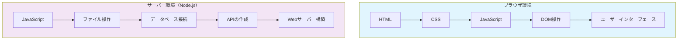
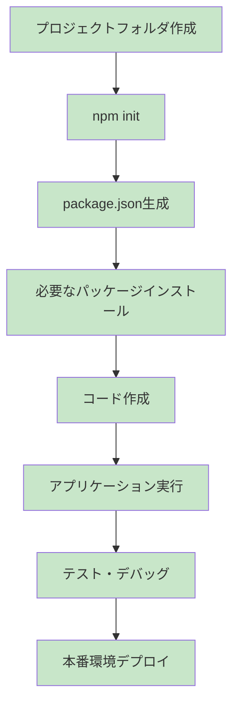

# Node.jsとは何か

この章では、これからNode.js開発を始める新人エンジニアの皆さんに向けて、Node.jsの基本概念と開発環境構築の全体像を分かりやすく説明します。専門用語も丁寧に解説しますので、安心して読み進めてください。

## Node.jsの基本概念

### JavaScriptランタイムとしてのNode.js

**Node.js**とは、簡単に言うと「**サーバー上でJavaScriptを実行できるようにする環境**」のことです。

今まで皆さんが学習してきたJavaScriptは、主にWebブラウザ上で動作していました。例えば、ボタンをクリックしたときの動作や、フォームの入力チェックなどです。しかし、Node.jsを使うことで、JavaScriptをサーバー側でも実行できるようになります。

#### 用語解説：ランタイム（Runtime）
**ランタイム**とは、プログラムが実際に動作する環境のことです。
- **ブラウザランタイム**：Chrome、Firefox、EdgeなどのWebブラウザ上でJavaScriptが動く環境
- **Node.jsランタイム**：サーバーやパソコン上で直接JavaScriptが動く環境

#### ブラウザとサーバーでのJavaScript実行環境の違い



**ブラウザでのJavaScript**：
- HTMLやCSSと連携してWebページを操作
- ユーザーの操作（クリック、入力など）に反応
- セキュリティの制約が多い（ファイルに直接アクセスできないなど）

**Node.jsでのJavaScript**：
- ファイルの読み書きができる
- データベースに直接接続できる
- Webサーバーを作成できる
- コマンドライン**ツール**を作成できる

#### 用語解説：ツール（Tool）
プログラミングにおける**ツール**とは、開発を効率的に進めるための補助プログラムのことです。例えば、ファイル変換、コード整形、テスト実行などを自動化するプログラムです。

### V8エンジンの特徴とパフォーマンス

Node.jsは**V8エンジン**というGoogleが開発したJavaScript実行エンジンを使用しています。

#### 用語解説：V8エンジン
**V8エンジン**は、JavaScriptコードを高速で実行するためのソフトウェアです。Google Chromeブラウザでも同じV8エンジンが使われています。

**V8エンジンの特徴**：
1. **高速実行**：JavaScriptコードを機械語に変換して実行するため、非常に高速
2. **メモリ効率**：効率的なメモリ管理で、大量のデータも適切に処理
3. **最新仕様対応**：JavaScriptの最新機能にいち早く対応

#### 用語解説：機械語（Machine Language）
**機械語**とは、コンピューターが直接理解できる言語（0と1の組み合わせ）のことです。JavaScriptコードを機械語に変換することで、より高速に実行できます。

### Node.jsが解決する問題

Node.js登場以前は、以下のような問題がありました：

**問題1：プログラミング言語の分離**
- フロントエンド（ユーザーが見る部分）：JavaScript
- バックエンド（サーバー側）：PHP、Java、Python、Ruby など

**Node.jsによる解決**：
- フロントエンドもバックエンドもJavaScriptで統一
- 学習コストの削減
- チーム内でのスキル共有が容易

#### 用語解説：フロントエンド・バックエンド
- **フロントエンド**：ユーザーが直接操作するWebページの見た目や動作部分
- **バックエンド**：ユーザーからは見えないサーバー側の処理（データ保存、計算処理など）

**問題2：開発効率の低下**
- 言語ごとに異なる開発環境の構築
- 言語間でのデータ受け渡しの複雑さ

**Node.jsによる解決**：
- 同じ開発環境、同じツールで一貫した開発
- JSONデータの自然な扱い

#### 用語解説：JSON（JavaScript Object Notation）
**JSON**は、データを交換するための軽量なフォーマットです。JavaScriptのオブジェクト記法をベースにしており、多くのプログラミング言語で読み書きできます。

```json
{
  "name": "田中太郎",
  "age": 25,
  "skills": ["JavaScript", "HTML", "CSS"]
}
```

## Node.jsの主要な特徴

### 非同期・イベント駆動アーキテクチャ

Node.jsの最大の特徴は**非同期処理**と**イベント駆動**のアーキテクチャです。

#### 用語解説：同期処理と非同期処理

**同期処理**：
```javascript
// 同期処理の例（ブロッキング）
console.log("処理1開始");
// 3秒待機（この間他の処理は止まる）
setTimeout(() => {}, 3000);
console.log("処理1完了");
console.log("処理2開始"); // 処理1が完了してから実行
```

**非同期処理**：
```javascript
// 非同期処理の例（ノンブロッキング）
console.log("処理1開始");
// 3秒後に実行される処理を予約（他の処理は止まらない）
setTimeout(() => {
  console.log("処理1完了");
}, 3000);
console.log("処理2開始"); // すぐに実行される
```

#### レストランでの例え

**同期処理（従来の方式）**：
1. お客様Aの注文を取る
2. お客様Aの料理を作る（他のお客様は待機）
3. お客様Aに料理を提供
4. 次にお客様Bの注文を取る

**非同期処理（Node.js方式）**：
1. お客様Aの注文を取る
2. キッチンに注文を渡す（料理は並行して作られる）
3. すぐにお客様Bの注文を取る
4. お客様Cの注文も取る
5. 料理ができた順番で提供

### イベント駆動アーキテクチャ

#### 用語解説：イベント駆動（Event-Driven）
**イベント駆動**とは、何かの出来事（イベント）が発生したときに、それに対応する処理を実行する仕組みです。

```javascript
// イベント駆動の例
const fs = require('fs'); // ファイルシステムモジュール

// ファイル読み込み完了イベントに対する処理を定義
fs.readFile('sample.txt', 'utf8', (err, data) => {
  if (err) {
    console.log('エラーが発生しました:', err);
    return;
  }
  console.log('ファイル読み込み完了:', data);
});

console.log('ファイル読み込みを開始しました');
// この行はファイル読み込み完了を待たずにすぐ実行される
```

#### 用語解説：モジュール（Module）
**モジュール**とは、特定の機能をまとめたプログラムの部品です。Node.jsでは、ファイル操作、HTTP通信、暗号化など、様々な機能がモジュールとして提供されています。

### シングルスレッドモデルの利点

#### 用語解説：スレッド（Thread）
**スレッド**とは、プログラムの実行単位のことです。
- **シングルスレッド**：1つの作業を順番に実行
- **マルチスレッド**：複数の作業を同時に実行

Node.jsは基本的にシングルスレッドですが、**イベントループ**という仕組みで効率的に処理を行います。

#### 用語解説：イベントループ（Event Loop）
**イベントループ**は、イベントの発生を監視し、適切な処理を実行する仕組みです。


**シングルスレッドの利点**：
1. **メモリ効率**：複数のスレッドを管理する必要がない
2. **デッドロック回避**：複数スレッド間での競合が発生しない
3. **簡単なデバッグ**：処理の流れが分かりやすい

#### 用語解説：デッドロック（Deadlock）
**デッドロック**とは、複数のスレッドがお互いの処理完了を待ち続けて、全体が停止してしまう現象です。

### 豊富なエコシステム（npm）

Node.jsの大きな強みの一つが**npm（Node Package Manager）**による豊富なエコシステムです。

#### 用語解説：エコシステム（Ecosystem）
**エコシステム**とは、相互に関連し合う要素が形成する全体的な環境のことです。プログラミングでは、言語、ツール、ライブラリ、コミュニティなどが含まれます。

#### npmとは

**npm**は以下の機能を提供します：

1. **パッケージ管理**：他の開発者が作った便利なコードを簡単にインストール
2. **依存関係管理**：必要なパッケージを自動的に管理
3. **バージョン管理**：パッケージのバージョンを適切に管理

#### 用語解説：パッケージ（Package）
**パッケージ**とは、特定の機能を提供するプログラムの集合体です。例えば、日付操作、画像処理、Webサーバー構築など、様々な機能がパッケージとして提供されています。

```bash
# パッケージのインストール例
npm install express  # Webサーバー構築用パッケージ
npm install moment   # 日付操作用パッケージ
npm install lodash   # ユーティリティ関数パッケージ
```

**npmの利点**：
- 100万を超えるパッケージが利用可能
- 活発なコミュニティによる継続的な開発
- セキュリティ監査機能
- 簡単なインストールとアップデート

## 開発環境構築の全体像

### 必要なツールとその役割

Node.js開発を始めるために必要なツールは以下の通りです：

#### 1. Node.js本体とnpm

**Node.js本体**：
- JavaScriptの実行環境
- サーバーサイドアプリケーションの実行基盤

**npm（Node Package Manager）**：
- パッケージ管理ツール
- Node.jsと一緒に自動インストールされる
- 世界中の開発者が作ったパッケージを利用可能

#### 2. エディタ（VS Code）

**Visual Studio Code（VS Code）**：
- Microsoft が開発した無料のコードエディタ
- Node.js開発に最適化された機能が豊富
- 拡張機能により機能をさらに追加可能

#### 用語解説：IDE と エディタ
- **エディタ**：コードを書くためのソフトウェア（シンプル）
- **IDE（統合開発環境）**：エディタ + デバッガ + コンパイラなどを統合した環境（高機能）

VS Codeは、エディタでありながらIDEに近い機能を持っています。

#### 3. ターミナル（Git Bash、PowerShell）

**ターミナル**とは、文字だけでコンピューターを操作するツールです。

#### 用語解説：ターミナル、コマンドライン、シェル
- **ターミナル**：文字ベースでコンピューターを操作するためのウィンドウ
- **コマンドライン**：ターミナルに文字（コマンド）を入力して操作する方式
- **シェル**：コマンドを解釈して実行するプログラム

**Windows環境での選択肢**：
- **PowerShell**：Windows標準のシェル（推奨）
- **コマンドプロンプト**：従来のWindowsシェル
- **Git Bash**：Git for Windowsに含まれるLinux風シェル

#### 4. バージョン管理システム（Git）

**Git**：
- コードの変更履歴を管理するツール
- チーム開発での協業に必須
- GitHub、GitLabなどのサービスと連携

#### 用語解説：バージョン管理システム
**バージョン管理システム**とは、ファイルの変更履歴を記録し、過去の状態に戻したり、複数人での作業を管理したりするシステムです。

### 開発ワークフローの基本

Node.js開発の基本的な流れは以下の通りです：

#### 1. プロジェクト作成から実行まで



**各ステップの詳細**：

1. **プロジェクトフォルダ作成**：開発するアプリケーション用のフォルダを作成
2. **npm init**：package.jsonファイルを生成（プロジェクトの設定ファイル）
3. **パッケージインストール**：必要な外部ライブラリをnpmでインストール
4. **コード作成**：JavaScriptファイルでアプリケーションのロジックを実装
5. **実行・テスト**：作成したアプリケーションを実行し、動作確認
6. **デプロイ**：完成したアプリケーションを本番環境に公開

#### 用語解説：デプロイ（Deploy）
**デプロイ**とは、開発したアプリケーションを実際にユーザーが利用できる環境（本番環境）に配置することです。

#### 2. パッケージ管理の基本

```javascript
// package.json の例
{
  "name": "my-first-node-app",
  "version": "1.0.0",
  "description": "私の最初のNode.jsアプリケーション",
  "main": "app.js",
  "scripts": {
    "start": "node app.js",
    "dev": "nodemon app.js",
    "test": "jest"
  },
  "dependencies": {
    "express": "^4.18.0"
  },
  "devDependencies": {
    "nodemon": "^2.0.15",
    "jest": "^27.5.0"
  }
}
```

#### 用語解説：dependencies と devDependencies
- **dependencies**：アプリケーション実行に必要なパッケージ
- **devDependencies**：開発時のみ必要なパッケージ（テストツール、ビルドツールなど）

#### 3. デバッグとテストの流れ

**デバッグ**：
- VS Codeのデバッガー機能を使用
- ブレークポイントを設定して処理を一時停止
- 変数の値を確認しながら問題を特定

#### 用語解説：デバッグ、ブレークポイント
- **デバッグ**：プログラムの問題（バグ）を見つけて修正する作業
- **ブレークポイント**：プログラムの実行を一時停止する地点

**テスト**：
- 自動テストでコードの品質を保証
- Jestなどのテストフレームワークを使用
- 継続的インテグレーション（CI）との連携

#### 用語解説：テストフレームワーク、継続的インテグレーション
- **テストフレームワーク**：テストコードを書き、実行するための仕組み
- **継続的インテグレーション（CI）**：コードの変更があるたびに自動的にテストを実行する仕組み

## まとめ

この章では、Node.jsの基本概念と開発環境の全体像について学習しました。

**重要なポイント**：

1. **Node.jsはサーバーサイドJavaScript実行環境**
   - ブラウザだけでなく、サーバーでもJavaScriptが動作
   - V8エンジンによる高速実行

2. **非同期・イベント駆動が特徴**
   - 効率的な処理で高いパフォーマンスを実現
   - シングルスレッドモデルでシンプルな構造

3. **豊富なエコシステム**
   - npmによる大量のパッケージ
   - 活発なコミュニティ

4. **必要なツール群の理解**
   - Node.js + npm（実行環境）
   - VS Code（エディタ）
   - PowerShell（ターミナル）
   - Git（バージョン管理）

次の章では、実際にWindows環境でNode.jsをインストールする方法を学習します。今回学んだ基礎知識を踏まえて、実際に手を動かしながら環境構築を進めていきましょう。

## 用語集

本章で出てきた重要な用語をまとめました。分からない用語があったときの参考にしてください。

| 用語 | 説明 |
|------|------|
| ランタイム | プログラムが実際に動作する環境 |
| V8エンジン | Googleが開発したJavaScript実行エンジン |
| 機械語 | コンピューターが直接理解できる言語（0と1の組み合わせ） |
| フロントエンド | ユーザーが直接操作するWebページの見た目や動作部分 |
| バックエンド | サーバー側の処理（データ保存、計算処理など） |
| JSON | データを交換するための軽量なフォーマット |
| 同期処理 | 一つの処理が完了してから次の処理を実行する方式 |
| 非同期処理 | 複数の処理を並行して実行する方式 |
| イベント駆動 | 何かの出来事が発生したときに対応する処理を実行する仕組み |
| スレッド | プログラムの実行単位 |
| イベントループ | イベントの発生を監視し、適切な処理を実行する仕組み |
| デッドロック | 複数のスレッドがお互いの処理完了を待ち続けて停止する現象 |
| エコシステム | 相互に関連し合う要素が形成する全体的な環境 |
| パッケージ | 特定の機能を提供するプログラムの集合体 |
| モジュール | 特定の機能をまとめたプログラムの部品 |
| IDE | エディタ + デバッガ + コンパイラなどを統合した開発環境 |
| ターミナル | 文字ベースでコンピューターを操作するためのウィンドウ |
| シェル | コマンドを解釈して実行するプログラム |
| バージョン管理システム | ファイルの変更履歴を記録・管理するシステム |
| デプロイ | アプリケーションを本番環境に配置すること |
| dependencies | アプリケーション実行に必要なパッケージ |
| devDependencies | 開発時のみ必要なパッケージ |
| デバッグ | プログラムの問題を見つけて修正する作業 |
| ブレークポイント | プログラムの実行を一時停止する地点 |
| テストフレームワーク | テストコードを書き、実行するための仕組み |
| CI | コードの変更があるたびに自動的にテストを実行する仕組み |