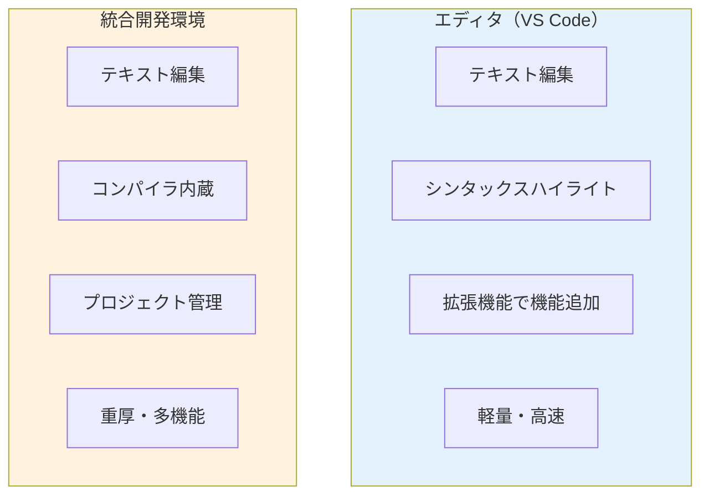

# VS Codeのインストールと基本設定

この章では、Node.js開発に最適化されたエディタ環境を構築します。**Visual Studio Code（VS Code）**は、Microsoft が開発した無料のコードエディタで、Node.js開発において最も人気の高いツールの一つです。

## VS Codeとは

### VS Codeの特徴

**Visual Studio Code**は以下の特徴を持つモダンなコードエディタです：

1. **無料でオープンソース**
2. **軽量で高速**
3. **豊富な拡張機能**
4. **統合ターミナル**
5. **強力なデバッグ機能**
6. **Git統合**

#### 用語解説：オープンソース
**オープンソース**とは、ソースコード（プログラムの設計図）が公開されており、誰でも自由に使用・改変・配布できるソフトウェアのことです。

### エディタ vs IDE の違い



**VS Codeの位置づけ**：
- エディタとIDEの中間的存在
- 拡張機能により必要な機能を追加
- 軽量性と機能性のバランスが良い

#### 用語解説：シンタックスハイライト
**シンタックスハイライト**とは、プログラムコードの構文に応じて色分け表示する機能です。コードの読みやすさと理解しやすさが大幅に向上します。

## VS Codeのダウンロードとインストール

### システム要件

- **OS**: Windows 10/11 (64-bit)
- **メモリ**: 1GB以上（推奨：4GB以上）
- **ディスク容量**: 200MB以上

### インストール手順

#### Step 1: 公式サイトからダウンロード

1. **VS Code公式サイトにアクセス**
   ```
   https://code.visualstudio.com/
   ```

2. **Downloadボタンをクリック**
   - 自動的にWindows用のインストーラーを検出
   - 「Download for Windows」をクリック

3. **ダウンロード完了の確認**
   - ファイル名：`VSCodeUserSetup-x64-x.xx.x.exe`
   - ファイルサイズ：約100MB

#### Step 2: インストーラーの実行

1. **ダウンロードしたファイルを実行**
   - セキュリティ警告が表示されたら「実行」をクリック

2. **インストールウィザードに従って進行**

   **License Agreement**：
   - ライセンス条項を確認
   - 「同意する」を選択
   - 「次へ」をクリック

   **Select Destination Location**：
   - インストール先フォルダ
   - デフォルトのまま推奨
   - 「次へ」をクリック

   **Select Start Menu Folder**：
   - スタートメニューの登録
   - デフォルトのまま推奨
   - 「次へ」をクリック

   **Select Additional Tasks**：
   - 以下のオプションを**すべてチェック**することを推奨：
     - ☑ デスクトップ上にアイコンを作成する
     - ☑ PATH環境変数に追加する
     - ☑ Windowsエクスプローラーのファイル コンテキスト メニューに追加する
     - ☑ Windowsエクスプローラーのディレクトリ コンテキスト メニューに追加する
     - ☑ サポートされているファイルの種類のエディターとして、Code を登録する
   - 「次へ」をクリック

#### 用語解説：コンテキストメニュー
**コンテキストメニュー**とは、ファイルやフォルダを右クリックしたときに表示されるメニューのことです。VS Codeを追加することで、右クリックから直接VS Codeでファイルを開けるようになります。

   **Ready to Install**：
   - 設定内容の確認
   - 「インストール」をクリック
   - インストール開始（数分程度）

   **Installation Complete**：
   - 「VS Code を実行する」にチェックを入れる
   - 「完了」をクリック

#### Step 3: 初回起動の確認

VS Codeが起動し、**Welcome**タブが表示されれば、インストール成功です。

## 日本語化と基本設定

### Japanese Language Pack のインストール

VS Codeは標準では英語表示です。日本語化するには拡張機能をインストールします。

#### Step 1: 拡張機能パネルを開く

1. **方法1**: サイドバーの拡張機能アイコンをクリック
2. **方法2**: `Ctrl + Shift + X` のショートカット
3. **方法3**: メニュー「View」→「Extensions」

#### Step 2: Japanese Language Packを検索

1. 検索ボックスに「japanese」と入力
2. 「Japanese Language Pack for Visual Studio Code」を見つける
3. 「Install」ボタンをクリック

#### Step 3: 再起動して日本語化を適用

1. インストール完了後、右下に通知が表示される
2. 「Change Language and Restart」をクリック
3. VS Codeが再起動し、日本語表示になる

### 基本設定のカスタマイズ

#### 設定画面の開き方

1. **方法1**: `Ctrl + ,` のショートカット
2. **方法2**: メニュー「ファイル」→「ユーザー設定」→「設定」
3. **方法3**: `F1` → 「基本設定: 設定を開く」

#### 推奨基本設定

**1. フォント設定**
```json
{
  "editor.fontFamily": "Consolas, 'Courier New', monospace",
  "editor.fontSize": 14,
  "editor.fontWeight": "normal"
}
```

#### 用語解説：等幅フォント
**等幅フォント（monospace）**とは、すべての文字の幅が同じフォントです。プログラミングでは、コードの整列や可読性のために等幅フォントを使用します。

**2. タブとインデント設定**
```json
{
  "editor.tabSize": 2,
  "editor.insertSpaces": true,
  "editor.detectIndentation": true
}
```

#### 用語解説：インデント
**インデント**とは、コードの構造を視覚的に分かりやすくするための字下げのことです。JavaScriptでは通常2スペースまたは4スペースが使用されます。

**3. 自動保存設定**
```json
{
  "files.autoSave": "afterDelay",
  "files.autoSaveDelay": 1000
}
```

**4. 表示設定**
```json
{
  "editor.wordWrap": "on",
  "editor.lineNumbers": "on",
  "editor.rulers": [80, 120],
  "workbench.activityBar.visible": true
}
```

#### 用語解説：ルーラー
**ルーラー**とは、コードの行の長さを視覚的に示すガイドラインです。80文字や120文字の位置に縦線を表示し、コードの可読性を保つ目安となります。

**5. ファイル管理設定**
```json
{
  "files.exclude": {
    "**/node_modules": true,
    "**/.git": true,
    "**/.DS_Store": true,
    "**/Thumbs.db": true
  }
}
```

### テーマの設定

#### カラーテーマの変更

1. **方法1**: `Ctrl + K` → `Ctrl + T`
2. **方法2**: メニュー「ファイル」→「ユーザー設定」→「配色テーマ」

**人気のテーマ**：
- **Dark+ (default dark)**: VS Code標準のダークテーマ
- **Light+ (default light)**: VS Code標準のライトテーマ
- **One Dark Pro**: 人気の高いダークテーマ
- **Material Theme**: Googleマテリアルデザインベース

#### アイコンテーマの設定

1. メニュー「ファイル」→「ユーザー設定」→「ファイル アイコン テーマ」
2. **推奨**: 「Material Icon Theme」（拡張機能として別途インストールが必要）

## Node.js開発に必要な拡張機能

### 必須拡張機能

#### 1. ESLint（コード品質チェック）

**目的**: JavaScriptコードの品質を自動チェック

**インストール方法**:
1. 拡張機能パネルで「ESLint」を検索
2. 「ESLint」（作者: Microsoft）をインストール

**設定例**:
```json
{
  "eslint.enable": true,
  "eslint.autoFixOnSave": true,
  "eslint.validate": ["javascript", "typescript"]
}
```

#### 用語解説：ESLint
**ESLint**は、JavaScriptコードの静的解析ツールです。コードの品質問題、潜在的なバグ、スタイルの一貫性などをチェックし、開発者に警告を表示します。

#### 2. Prettier（コードフォーマッター）

**目的**: コードの自動整形

**インストール方法**:
1. 拡張機能パネルで「Prettier」を検索
2. 「Prettier - Code formatter」をインストール

**設定例**:
```json
{
  "editor.defaultFormatter": "esbenp.prettier-vscode",
  "editor.formatOnSave": true,
  "prettier.singleQuote": true,
  "prettier.semi": true,
  "prettier.tabWidth": 2
}
```

#### 用語解説：コードフォーマッター
**コードフォーマッター**は、コードの見た目を統一された形式に自動的に整形するツールです。インデント、スペース、改行などを一定のルールに従って調整します。

#### 3. Node.js Extension Pack

**目的**: Node.js開発に必要な拡張機能をまとめてインストール

**含まれる拡張機能**:
- npm Intellisense
- Path Intellisense
- Bracket Pair Colorizer
- Auto Rename Tag
- GitLens

#### 4. JavaScript (ES6) code snippets

**目的**: よく使用するJavaScriptコードのスニペット

#### 用語解説：スニペット
**スニペット**とは、よく使用するコードの断片をテンプレートとして保存し、簡単なキーワードで呼び出せる機能です。効率的なコーディングに役立ちます。

**使用例**:
- `log` → `console.log()`
- `func` → 関数の雛形
- `arrow` → アロー関数の雛形

### 便利な拡張機能

#### 1. Auto Rename Tag

**目的**: HTMLタグの開始・終了タグを自動で同期

#### 2. Bracket Pair Colorizer 2

**目的**: 対応する括弧を色分け表示

#### 3. GitLens

**目的**: Git機能の大幅な拡張

**主な機能**:
- コード行ごとの最終変更者表示
- コミット履歴の詳細表示
- ブランチ管理の強化

#### 4. Live Server

**目的**: 静的ファイル用の開発サーバー

**使用方法**:
1. HTMLファイルを右クリック
2. 「Open with Live Server」を選択
3. ブラウザで自動リロード機能付きでプレビュー

#### 5. REST Client

**目的**: API テスト用のHTTPクライアント

**使用例**:
```http
# test.http
GET http://localhost:3000/api/users
Content-Type: application/json

###

POST http://localhost:3000/api/users
Content-Type: application/json

{
  "name": "田中太郎",
  "email": "tanaka@example.com"
}
```

## VS Codeの重要機能

### 統合ターミナル

#### ターミナルの開き方

1. **方法1**: `Ctrl + `` (バッククォート)
2. **方法2**: メニュー「ターミナル」→「新しいターミナル」
3. **方法3**: `Ctrl + Shift + P` → 「ターミナル: 新しいターミナルを作成」

#### ターミナルの種類選択

VS Codeでは複数のシェルを選択できます：

1. **PowerShell**（推奨）
2. **コマンドプロンプト**
3. **Git Bash**（Git for Windowsインストール後）

**設定方法**:
1. ターミナル内で下向き矢印をクリック
2. 「既定のプロファイルの選択」
3. 使用したいシェルを選択

### ファイルとフォルダの管理

#### ワークスペースの概念

**ワークスペース**とは、VS Code で開いているプロジェクトのルートフォルダのことです。

#### 用語解説：ワークスペース
**ワークスペース**は、関連するファイルやフォルダをまとめた作業領域です。プロジェクト固有の設定や拡張機能の設定もワークスペース単位で管理できます。

#### フォルダの開き方

1. **方法1**: メニュー「ファイル」→「フォルダーを開く」
2. **方法2**: `Ctrl + K` → `Ctrl + O`
3. **方法3**: エクスプローラーでフォルダを右クリック → 「Code で開く」

#### ファイル作成のショートカット

- **新しいファイル**: `Ctrl + N`
- **ファイルを開く**: `Ctrl + O`
- **ファイルを保存**: `Ctrl + S`
- **名前を付けて保存**: `Ctrl + Shift + S`

### コマンドパレット

**コマンドパレット**は、VS Code の全機能にアクセスできる強力なツールです。

#### 開き方
- `F1` または `Ctrl + Shift + P`

#### よく使うコマンド
- `> Reload Window`: ウィンドウの再読み込み
- `> Developer: Reload Window`: 開発用再読み込み
- `> Preferences: Open Settings (JSON)`: 設定ファイルを直接編集
- `> Git: Clone`: リポジトリのクローン

### マルチカーソル機能

**マルチカーソル**は、複数の場所を同時に編集できる機能です。

#### 使用方法

1. **同じ単語の選択**: `Ctrl + D`
2. **すべての同じ単語を選択**: `Ctrl + Shift + L`
3. **Alt + クリック**: 任意の場所にカーソル追加
4. **Alt + Shift + ドラッグ**: 矩形選択

#### 用語解説：矩形選択
**矩形選択**とは、長方形の範囲を選択して、その範囲内の各行で同じ位置を同時に編集できる機能です。

### 検索と置換

#### 基本的な検索

1. **ファイル内検索**: `Ctrl + F`
2. **ファイル内置換**: `Ctrl + H`
3. **ワークスペース検索**: `Ctrl + Shift + F`
4. **ワークスペース置換**: `Ctrl + Shift + H`

#### 正規表現検索

検索ボックスの `.*` ボタンをクリックして正規表現を有効化

**例**:
```regex
function\s+(\w+)\s*\(
// function で始まる関数定義を検索
```

#### 用語解説：正規表現
**正規表現**とは、文字列のパターンを表現する記法です。柔軟で強力な検索・置換を行うことができます。

## プロジェクト固有の設定

### .vscode フォルダ

プロジェクトのルートに `.vscode` フォルダを作成することで、そのプロジェクト専用の設定を保存できます。

#### settings.json（プロジェクト設定）

```json
// .vscode/settings.json
{
  "editor.tabSize": 4,
  "editor.insertSpaces": true,
  "files.exclude": {
    "**/node_modules": true,
    "**/dist": true
  },
  "search.exclude": {
    "**/node_modules": true,
    "**/dist": true
  }
}
```

#### tasks.json（タスク設定）

```json
// .vscode/tasks.json
{
  "version": "2.0.0",
  "tasks": [
    {
      "label": "npm start",
      "type": "shell",
      "command": "npm",
      "args": ["start"],
      "group": "build",
      "presentation": {
        "echo": true,
        "reveal": "always",
        "focus": false,
        "panel": "shared"
      }
    }
  ]
}
```

#### launch.json（デバッグ設定）

```json
// .vscode/launch.json
{
  "version": "0.2.0",
  "configurations": [
    {
      "type": "node",
      "request": "launch",
      "name": "Launch Program",
      "skipFiles": ["<node_internals>/**"],
      "program": "${workspaceFolder}/app.js"
    }
  ]
}
```

### EditorConfig

**EditorConfig**は、エディタ間でコードスタイルを統一するための設定ファイルです。

#### .editorconfig ファイルの作成

```ini
# .editorconfig
root = true

[*]
charset = utf-8
end_of_line = lf
indent_style = space
indent_size = 2
insert_final_newline = true
trim_trailing_whitespace = true

[*.md]
trim_trailing_whitespace = false
```

#### 用語解説：EditorConfig
**EditorConfig**は、異なるエディタやIDE間でコーディングスタイルを統一するためのファイル形式です。チーム開発では特に重要です。

## Git統合機能

### 基本的なGit操作

VS Code には強力なGit統合機能が内蔵されています。

#### ソース管理パネル

1. **開き方**: サイドバーのソース管理アイコン（`Ctrl + Shift + G`）
2. **変更ファイルの確認**: 変更されたファイルが一覧表示
3. **ステージング**: ファイル横の `+` ボタンでステージに追加
4. **コミット**: メッセージを入力して `Ctrl + Enter`

#### 用語解説：ステージング
**ステージング**とは、コミットに含めるファイルの変更を選択する作業です。Gitでは、変更したファイルを直接コミットするのではなく、一度ステージに追加してからコミットします。

#### インラインGit情報

コードエディタ内でGit情報を直接確認できます：

- **Gutter indicators**: 行番号横に変更状態を表示
- **Inline blame**: 各行の最終更新者とコミット情報を表示（GitLens拡張）
- **Diff viewer**: ファイルの変更差分を並列表示

### ブランチ管理

#### ブランチの作成と切り替え

1. **ステータスバーのブランチ名をクリック**
2. **コマンドパレット**: `Git: Create Branch`
3. **ソース管理パネル**: 「...」メニュー → 「ブランチ」

#### マージとプルリクエスト

VS Code から直接GitHub のプルリクエストを作成・管理できます（GitHub Pull Requests 拡張機能を使用）。

## 効率的な開発のためのショートカット

### 必須ショートカット一覧

#### ファイル操作
- `Ctrl + N`: 新しいファイル
- `Ctrl + O`: ファイルを開く
- `Ctrl + S`: 保存
- `Ctrl + Shift + S`: 名前を付けて保存
- `Ctrl + W`: タブを閉じる
- `Ctrl + Shift + T`: 閉じたタブを再度開く

#### 編集操作
- `Ctrl + Z`: 元に戻す
- `Ctrl + Y`: やり直し
- `Ctrl + X`: 切り取り
- `Ctrl + C`: コピー
- `Ctrl + V`: 貼り付け
- `Ctrl + A`: 全選択

#### 検索・移動
- `Ctrl + F`: 検索
- `Ctrl + H`: 置換
- `Ctrl + G`: 指定行に移動
- `Ctrl + P`: ファイルを開く（クイックオープン）
- `Ctrl + Shift + P`: コマンドパレット

#### 表示操作
- `Ctrl + +`: ズームイン
- `Ctrl + -`: ズームアウト
- `Ctrl + 0`: ズームリセット
- `F11`: フルスクリーン切り替え
- `Ctrl + B`: サイドバー表示切り替え

#### コード編集
- `Ctrl + /`: 行コメント切り替え
- `Shift + Alt + A`: ブロックコメント切り替え
- `Alt + ↑/↓`: 行の移動
- `Shift + Alt + ↑/↓`: 行のコピー
- `Ctrl + Shift + K`: 行の削除

## トラブルシューティング

### よくある問題と解決方法

#### 問題1: 拡張機能が動作しない

**原因**: 拡張機能の設定問題またはコンフリクト

**解決方法**:
1. VS Code を再起動
2. 拡張機能を無効化してから再度有効化
3. コマンドパレット → `Developer: Reload Window`

#### 問題2: ターミナルでコマンドが認識されない

**原因**: PATH設定の問題またはシェルの設定問題

**解決方法**:
1. VS Code を再起動
2. ターミナルの種類を変更（PowerShell ↔ コマンドプロンプト）
3. システムの環境変数を確認

#### 問題3: Git操作ができない

**原因**: Git のインストールまたは設定の問題

**解決方法**:
1. Git for Windows がインストールされているか確認
2. Git の初期設定（user.name, user.email）を確認
3. VS Code の Git 設定を確認

#### 問題4: 日本語化されない

**原因**: Japanese Language Pack の設定問題

**解決方法**:
1. 拡張機能パネルで Japanese Language Pack が有効になっているか確認
2. コマンドパレット → `Configure Display Language` → `ja` を選択
3. VS Code を再起動

## まとめ

この章では、Node.js開発に最適化されたVS Code環境の構築方法を学習しました。

**重要なポイント**:

1. **VS Code の基本設定**
   - 日本語化
   - フォントとテーマの設定
   - 自動保存とフォーマット設定

2. **必須拡張機能**
   - ESLint: コード品質管理
   - Prettier: コード整形
   - Node.js Extension Pack: 開発効率化

3. **重要機能の活用**
   - 統合ターミナル
   - コマンドパレット
   - Git統合機能

4. **プロジェクト固有設定**
   - .vscode フォルダの活用
   - EditorConfig による統一

5. **効率的な開発**
   - ショートカットの活用
   - マルチカーソル機能
   - 検索・置換機能

次の章では、実際にNode.jsプロジェクトを作成し、基本的な開発ワークフローを実践します。構築したVS Code環境を活用して、効率的な開発を体験していきましょう。

## 用語集

| 用語 | 説明 |
|------|------|
| オープンソース | ソースコードが公開されており、自由に使用・改変できるソフトウェア |
| シンタックスハイライト | プログラムコードの構文に応じて色分け表示する機能 |
| コンテキストメニュー | ファイルやフォルダを右クリックしたときに表示されるメニュー |
| 等幅フォント | すべての文字の幅が同じフォント |
| インデント | コードの構造を視覚的に分かりやすくするための字下げ |
| ルーラー | コードの行の長さを視覚的に示すガイドライン |
| ESLint | JavaScriptコードの静的解析ツール |
| コードフォーマッター | コードの見た目を統一された形式に自動整形するツール |
| スニペット | よく使用するコードの断片のテンプレート |
| ワークスペース | VS Codeで開いているプロジェクトのルートフォルダ |
| 矩形選択 | 長方形の範囲を選択して同時編集する機能 |
| 正規表現 | 文字列のパターンを表現する記法 |
| EditorConfig | エディタ間でコーディングスタイルを統一するファイル形式 |
| ステージング | コミットに含めるファイルの変更を選択する作業 |