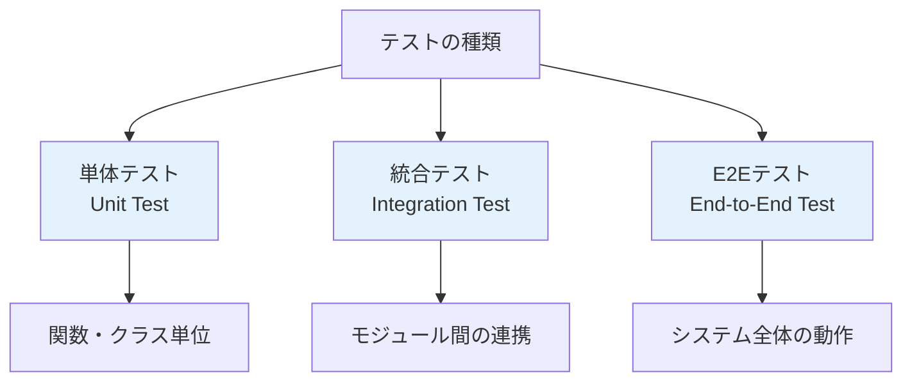
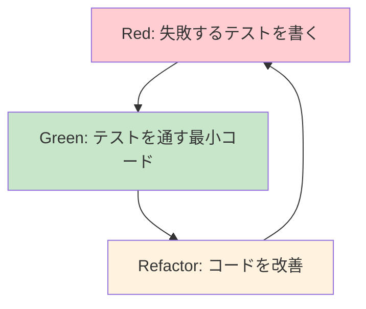

# VS Codeでのデバッグ設定

この章では、効率的な開発のためのデバッグとテスト環境を構築します。VS Codeの強力なデバッグ機能と、Node.jsでよく使用されるテストフレームワークを活用して、品質の高いコードを書けるようになりましょう。

## デバッグとは

**デバッグ**とは、プログラムの問題（バグ）を見つけて修正する作業のことです。効率的なデバッグができると、開発速度が大幅に向上します。

### デバッグの重要性

1. **問題の早期発見**: 小さな問題を早期に発見し、大きな問題に発展する前に解決
2. **コードの理解**: プログラムの実行過程を追跡してコードの動作を理解
3. **品質向上**: バグの少ない、信頼性の高いソフトウェアの作成
4. **開発効率**: 問題解決にかかる時間の短縮

### 従来のデバッグ手法の問題

```javascript
// 従来の方法（console.log デバッグ）
function calculateTax(price, rate) {
  console.log('price:', price);  // デバッグ用
  console.log('rate:', rate);    // デバッグ用
  
  const tax = price * rate;
  console.log('tax:', tax);      // デバッグ用
  
  return tax;
}
```

**問題点**:
- コードにデバッグ用のログが混在
- 本番環境でも出力されてしまう可能性
- 変数の値を確認するためにコードを変更する必要
- 削除し忘れによるコードの汚染

## VS Codeのデバッグ機能

### デバッガーの基本概念

#### 用語解説：主要なデバッグ用語
- **ブレークポイント**: プログラムの実行を一時停止する地点
- **ステップ実行**: 1行ずつプログラムを実行する機能
- **変数ウォッチ**: 特定の変数の値を監視する機能
- **コールスタック**: 関数の呼び出し履歴
- **スコープ**: 変数が参照できる範囲

### launch.json の作成

VS Codeでデバッグを行うには、`.vscode/launch.json` ファイルを作成する必要があります。

#### 自動生成による作成

1. **デバッグパネルを開く**: サイドバーの虫アイコンをクリック（`Ctrl + Shift + D`）
2. **「launch.jsonファイルを作成します」リンクをクリック**
3. **「Node.js」を選択**

#### 基本的な launch.json の例

```json
{
  "version": "0.2.0",
  "configurations": [
    {
      "type": "node",
      "request": "launch",
      "name": "Launch Program",
      "skipFiles": ["<node_internals>/**"],
      "program": "${workspaceFolder}/src/index.js"
    },
    {
      "type": "node",
      "request": "launch",
      "name": "Launch Server",
      "skipFiles": ["<node_internals>/**"],
      "program": "${workspaceFolder}/src/server.js",
      "env": {
        "NODE_ENV": "development"
      }
    },
    {
      "type": "node",
      "request": "attach",
      "name": "Attach to Process",
      "port": 9229,
      "skipFiles": ["<node_internals>/**"]
    }
  ]
}
```

#### 設定項目の説明

- **type**: デバッガーの種類（Node.jsの場合は "node"）
- **request**: "launch"（新規起動）または "attach"（既存プロセスに接続）
- **name**: デバッグ設定の表示名
- **program**: 実行するJavaScriptファイルのパス
- **skipFiles**: デバッグ時にスキップするファイル
- **env**: 環境変数の設定

#### 用語解説：${workspaceFolder}
**${workspaceFolder}**は、VS Codeで開いているワークスペースのルートフォルダを表す変数です。絶対パスの代わりに使用することで、どの環境でも動作する設定が作成できます。

### ブレークポイントの使い方

#### ブレークポイントの設定

1. **行番号の左側をクリック**: 赤い点が表示される
2. **F9キー**: カーソル行にブレークポイントを設定/解除
3. **右クリックメニュー**: 条件付きブレークポイントなど

#### ブレークポイントの種類

**1. 通常のブレークポイント**
```javascript
function processData(data) {
  const result = [];  // ← ここにブレークポイント設定
  
  for (let i = 0; i < data.length; i++) {
    const processed = data[i] * 2;
    result.push(processed);
  }
  
  return result;
}
```

**2. 条件付きブレークポイント**
```javascript
for (let i = 0; i < 100; i++) {
  const value = Math.random();  // ← 条件: i > 50
  console.log(value);
}
```

設定方法：
1. 行番号を右クリック
2. 「条件付きブレークポイント」を選択
3. 条件を入力（例：`i > 50`）

**3. ログポイント**
```javascript
function calculateDiscount(price, rate) {
  // ← ログポイント: "price: {price}, rate: {rate}"
  return price * (1 - rate);
}
```

ログポイントは、コードを止めずにログを出力する機能です。

### ステップ実行

デバッグ中に使用できる実行制御：

#### デバッグツールバーのボタン

1. **Continue (F5)**: 次のブレークポイントまで実行
2. **Step Over (F10)**: 次の行を実行（関数呼び出しは飛び越える）
3. **Step Into (F11)**: 関数内部に入る
4. **Step Out (Shift+F11)**: 現在の関数から抜ける
5. **Restart (Ctrl+Shift+F5)**: デバッグセッションを再起動
6. **Stop (Shift+F5)**: デバッグを停止

#### 実際の使用例

```javascript
// debug-example.js
function calculateTotal(items) {
  let total = 0;  // ← ブレークポイント1
  
  for (const item of items) {
    total += processItem(item);  // ← ブレークポイント2
  }
  
  return total;  // ← ブレークポイント3
}

function processItem(item) {
  const tax = item.price * 0.1;  // ← Step Into でここに入る
  return item.price + tax;
}

const items = [
  { name: 'Apple', price: 100 },
  { name: 'Banana', price: 80 },
  { name: 'Orange', price: 120 }
];

const result = calculateTotal(items);
console.log('Total:', result);
```

### 変数とスコープの確認

#### デバッグサイドバーのパネル

**1. Variables（変数）**
- **Local**: 現在のスコープの変数
- **Global**: グローバル変数
- **Closure**: クロージャ変数

**2. Watch（ウォッチ）**
- 特定の式の値を監視
- カスタム式の評価結果を表示

**3. Call Stack（コールスタック）**
- 関数の呼び出し履歴
- どの関数からどの関数が呼ばれたかを確認

**4. Breakpoints（ブレークポイント）**
- 設定されているブレークポイントの一覧
- 有効/無効の切り替え

#### ウォッチ式の例

```javascript
function complexCalculation(data) {
  const multiplier = 1.5;
  const bonus = 10;
  
  const result = data.map(item => {
    return item.value * multiplier + bonus;  // ← ブレークポイント
  });
  
  return result;
}
```

ウォッチに追加する式の例：
- `item.value`
- `multiplier * 2`
- `data.length`
- `result.filter(r => r > 100).length`

### デバッグコンソール

**デバッグコンソール**では、デバッグ中に任意のJavaScriptコードを実行できます。

#### 使用例

```javascript
function validateUser(user) {
  const isValid = user.name && user.email;  // ← ブレークポイント
  return isValid;
}
```

デバッグコンソールで試せること：
```javascript
// 変数の値を確認
user
user.name
user.email

// 計算を実行
user.name.length
user.email.includes('@')

// 関数を呼び出し
validateUser({name: 'Test', email: 'test@example.com'})

// 一時的に変数を変更
user.name = 'Modified Name'
```

## テスト環境の構築

### テストの重要性

**テスト**は、コードが期待通りに動作することを確認する自動化された手順です。

#### テストのメリット

1. **品質保証**: バグの早期発見
2. **リファクタリングの安全性**: コード改善時の動作保証
3. **ドキュメント化**: テストコード自体が仕様書となる
4. **チーム開発**: 他の開発者が変更した際の動作保証

#### テストの種類



### Jest テストフレームワーク

**Jest**は、Facebook が開発したJavaScriptテストフレームワークで、Node.js開発で最も人気があります。

#### Jestの特徴

- **ゼロ設定**: 複雑な設定不要で即座に使用開始
- **スナップショットテスト**: UI コンポーネントのテストに適している
- **モック機能**: 依存関係のモック作成が簡単
- **カバレッジレポート**: テストカバレッジの自動計算
- **並列実行**: テストの高速実行

#### Jestのインストール

```powershell
# Jest を開発依存関係としてインストール
npm install --save-dev jest

# TypeScript を使用する場合（オプション）
npm install --save-dev @types/jest
```

#### package.json の設定

```json
{
  "scripts": {
    "test": "jest",
    "test:watch": "jest --watch",
    "test:coverage": "jest --coverage"
  },
  "jest": {
    "testEnvironment": "node",
    "collectCoverageFrom": [
      "src/**/*.{js,jsx}",
      "!src/**/*.test.{js,jsx}"
    ]
  }
}
```

### 基本的なテストの作成

#### テスト関数の作成

```javascript
// src/math.js
/**
 * 二つの数値を加算する
 * @param {number} a 
 * @param {number} b 
 * @returns {number} 加算結果
 */
function add(a, b) {
  return a + b;
}

/**
 * 二つの数値を減算する
 * @param {number} a 
 * @param {number} b 
 * @returns {number} 減算結果
 */
function subtract(a, b) {
  return a - b;
}

/**
 * 配列の平均値を計算する
 * @param {number[]} numbers 
 * @returns {number} 平均値
 */
function average(numbers) {
  if (numbers.length === 0) {
    throw new Error('Empty array');
  }
  
  const sum = numbers.reduce((acc, num) => acc + num, 0);
  return sum / numbers.length;
}

/**
 * 偶数かどうかを判定する
 * @param {number} num 
 * @returns {boolean} 偶数の場合true
 */
function isEven(num) {
  return num % 2 === 0;
}

module.exports = {
  add,
  subtract,
  average,
  isEven
};
```

#### テストファイルの作成

```javascript
// src/math.test.js
const { add, subtract, average, isEven } = require('./math');

// describe: テストスイート（関連するテストをグループ化）
describe('Math functions', () => {
  
  // test または it: 個別のテストケース
  test('add function should correctly add two numbers', () => {
    // arrange: テストデータの準備
    const a = 5;
    const b = 3;
    
    // act: テスト対象の実行
    const result = add(a, b);
    
    // assert: 結果の検証
    expect(result).toBe(8);
  });
  
  test('subtract function should correctly subtract two numbers', () => {
    expect(subtract(10, 4)).toBe(6);
    expect(subtract(0, 5)).toBe(-5);
  });
  
  describe('average function', () => {
    test('should calculate average of positive numbers', () => {
      const numbers = [1, 2, 3, 4, 5];
      expect(average(numbers)).toBe(3);
    });
    
    test('should handle single number', () => {
      expect(average([10])).toBe(10);
    });
    
    test('should throw error for empty array', () => {
      expect(() => {
        average([]);
      }).toThrow('Empty array');
    });
  });
  
  describe('isEven function', () => {
    test('should return true for even numbers', () => {
      expect(isEven(2)).toBe(true);
      expect(isEven(0)).toBe(true);
      expect(isEven(-4)).toBe(true);
    });
    
    test('should return false for odd numbers', () => {
      expect(isEven(1)).toBe(false);
      expect(isEven(3)).toBe(false);
      expect(isEven(-3)).toBe(false);
    });
  });
});
```

#### 用語解説：AAA パターン
**AAA パターン**（Arrange-Act-Assert）は、テストコードの構造化手法です：
- **Arrange**: テストに必要なデータや状態を準備
- **Act**: テスト対象の機能を実行
- **Assert**: 結果が期待通りかを検証

### Jest のマッチャー（Matcher）

**マッチャー**は、期待値と実際の値を比較する関数です。

#### 基本的なマッチャー

```javascript
// 等価性のテスト
expect(2 + 2).toBe(4);                    // 厳密等価（===）
expect({name: 'John'}).toEqual({name: 'John'}); // オブジェクトの内容比較

// 真偽値のテスト
expect(true).toBeTruthy();                // 真と評価される値
expect(false).toBeFalsy();                // 偽と評価される値
expect(null).toBeNull();                  // null
expect(undefined).toBeUndefined();        // undefined
expect('Hello').toBeDefined();            // undefined以外

// 数値のテスト
expect(2 + 2).toBeGreaterThan(3);        // より大きい
expect(Math.PI).toBeCloseTo(3.14159);    // 近似値

// 文字列のテスト
expect('Hello World').toMatch(/World/);   // 正規表現マッチ
expect('Hello World').toContain('World'); // 部分文字列

// 配列のテスト
expect(['Alice', 'Bob', 'Charlie']).toContain('Bob');
expect([1, 2, 3]).toHaveLength(3);

// 例外のテスト
expect(() => {
  throw new Error('Test error');
}).toThrow('Test error');
```

### 非同期処理のテスト

#### Promise のテスト

```javascript
// src/async.js
function fetchUser(id) {
  return new Promise((resolve, reject) => {
    setTimeout(() => {
      if (id === 1) {
        resolve({ id: 1, name: 'John Doe', email: 'john@example.com' });
      } else {
        reject(new Error('User not found'));
      }
    }, 100);
  });
}

function calculateAsync(a, b) {
  return Promise.resolve(a + b);
}

module.exports = {
  fetchUser,
  calculateAsync
};
```

```javascript
// src/async.test.js
const { fetchUser, calculateAsync } = require('./async');

describe('Async functions', () => {
  
  // async/await を使用したテスト
  test('fetchUser should return user data for valid ID', async () => {
    const user = await fetchUser(1);
    
    expect(user).toEqual({
      id: 1,
      name: 'John Doe',
      email: 'john@example.com'
    });
  });
  
  test('fetchUser should reject for invalid ID', async () => {
    await expect(fetchUser(999)).rejects.toThrow('User not found');
  });
  
  // Promise を直接返すテスト
  test('calculateAsync should resolve with sum', () => {
    return expect(calculateAsync(5, 3)).resolves.toBe(8);
  });
});
```

#### タイムアウトの設定

```javascript
// 長時間実行されるテストのタイムアウト設定
test('long running test', async () => {
  // 5秒のタイムアウト
  const result = await longRunningFunction();
  expect(result).toBeDefined();
}, 5000);
```

### モック（Mock）の活用

**モック**は、テスト対象が依存する外部システムやモジュールの動作を模擬する機能です。

#### 関数のモック

```javascript
// src/user-service.js
const fs = require('fs').promises;

async function saveUser(user) {
  const data = JSON.stringify(user, null, 2);
  await fs.writeFile(`users/${user.id}.json`, data);
  return user;
}

async function loadUser(id) {
  const data = await fs.readFile(`users/${id}.json`, 'utf8');
  return JSON.parse(data);
}

module.exports = {
  saveUser,
  loadUser
};
```

```javascript
// src/user-service.test.js
const fs = require('fs').promises;
const { saveUser, loadUser } = require('./user-service');

// fs モジュールをモック化
jest.mock('fs', () => ({
  promises: {
    writeFile: jest.fn(),
    readFile: jest.fn()
  }
}));

describe('User Service', () => {
  beforeEach(() => {
    // 各テスト前にモックをリセット
    jest.clearAllMocks();
  });
  
  test('saveUser should write user data to file', async () => {
    const user = { id: 1, name: 'John', email: 'john@example.com' };
    
    // モックの戻り値を設定
    fs.writeFile.mockResolvedValue();
    
    const result = await saveUser(user);
    
    // モックが正しい引数で呼ばれたことを確認
    expect(fs.writeFile).toHaveBeenCalledWith(
      'users/1.json',
      JSON.stringify(user, null, 2)
    );
    
    expect(result).toEqual(user);
  });
  
  test('loadUser should read and parse user data', async () => {
    const userData = JSON.stringify({ id: 1, name: 'John' });
    
    // モックの戻り値を設定
    fs.readFile.mockResolvedValue(userData);
    
    const result = await loadUser(1);
    
    expect(fs.readFile).toHaveBeenCalledWith('users/1.json', 'utf8');
    expect(result).toEqual({ id: 1, name: 'John' });
  });
});
```

#### スパイ（Spy）の使用

```javascript
// src/logger.js
class Logger {
  log(message) {
    console.log(`[${new Date().toISOString()}] ${message}`);
  }
  
  error(message) {
    console.error(`[${new Date().toISOString()}] ERROR: ${message}`);
  }
}

module.exports = Logger;
```

```javascript
// src/logger.test.js
const Logger = require('./logger');

describe('Logger', () => {
  test('log method should call console.log with formatted message', () => {
    // console.log をスパイ化
    const consoleSpy = jest.spyOn(console, 'log').mockImplementation();
    
    const logger = new Logger();
    logger.log('Test message');
    
    // 呼び出されたことを確認
    expect(consoleSpy).toHaveBeenCalledTimes(1);
    expect(consoleSpy).toHaveBeenCalledWith(
      expect.stringMatching(/\[\d{4}-\d{2}-\d{2}T\d{2}:\d{2}:\d{2}\.\d{3}Z\] Test message/)
    );
    
    // スパイを元に戻す
    consoleSpy.mockRestore();
  });
});
```

### テストカバレッジ

**テストカバレッジ**は、テストによってカバーされるコードの割合を示す指標です。

#### カバレッジレポートの生成

```powershell
# カバレッジレポートを生成
npm run test:coverage
```

#### カバレッジレポートの見方

```
----------|---------|----------|---------|---------|-------------------
File      | % Stmts | % Branch | % Funcs | % Lines | Uncovered Line #s 
----------|---------|----------|---------|---------|-------------------
All files |   85.71 |       75 |      80 |   85.71 |                   
 math.js   |     100 |      100 |     100 |     100 |                   
 async.js  |      75 |       50 |      66 |      75 | 15-16             
----------|---------|----------|---------|---------|-------------------
```

**指標の説明**:
- **Stmts**: 実行された文の割合
- **Branch**: 実行された分岐の割合
- **Funcs**: 実行された関数の割合
- **Lines**: 実行された行の割合

### CI/CD でのテスト実行

#### GitHub Actions の設定例

```yaml
# .github/workflows/test.yml
name: Test

on:
  push:
    branches: [ main, develop ]
  pull_request:
    branches: [ main ]

jobs:
  test:
    runs-on: ubuntu-latest
    
    strategy:
      matrix:
        node-version: [18.x, 20.x, 22.x]
    
    steps:
    - uses: actions/checkout@v3
    
    - name: Setup Node.js ${{ matrix.node-version }}
      uses: actions/setup-node@v3
      with:
        node-version: ${{ matrix.node-version }}
        cache: 'npm'
    
    - name: Install dependencies
      run: npm ci
    
    - name: Run tests
      run: npm test
    
    - name: Generate coverage report
      run: npm run test:coverage
    
    - name: Upload coverage to Codecov
      uses: codecov/codecov-action@v3
```

#### 用語解説：CI/CD
**CI/CD**は継続的インテグレーション（Continuous Integration）と継続的デリバリー（Continuous Delivery）の略で、コードの変更を自動的にテスト・ビルド・デプロイする手法です。

## テスト駆動開発（TDD）

### TDD の基本サイクル

**テスト駆動開発（TDD）**は、テストを先に書いてからコードを実装する開発手法です。



### TDD の実践例

#### ステップ1: 失敗するテストを書く（Red）

```javascript
// src/calculator.test.js
const Calculator = require('./calculator');

describe('Calculator', () => {
  test('should add two positive numbers', () => {
    const calc = new Calculator();
    expect(calc.add(2, 3)).toBe(5);
  });
});
```

```powershell
# テスト実行（失敗する）
npm test
# Error: Cannot find module './calculator'
```

#### ステップ2: テストを通す最小コード（Green）

```javascript
// src/calculator.js
class Calculator {
  add(a, b) {
    return a + b;
  }
}

module.exports = Calculator;
```

```powershell
# テスト実行（成功する）
npm test
# PASS src/calculator.test.js
```

#### ステップ3: コードを改善（Refactor）

```javascript
// src/calculator.js
class Calculator {
  /**
   * 二つの数値を加算する
   * @param {number} a - 第一項
   * @param {number} b - 第二項
   * @returns {number} 加算結果
   */
  add(a, b) {
    this._validateNumber(a);
    this._validateNumber(b);
    return a + b;
  }
  
  _validateNumber(value) {
    if (typeof value !== 'number' || isNaN(value)) {
      throw new Error('Invalid number');
    }
  }
}

module.exports = Calculator;
```

### TDD のメリット

1. **品質の高いコード**: テストを先に書くことで、テスタブルな構造になる
2. **明確な仕様**: テストが仕様書の役割を果たす
3. **リファクタリングの安全性**: テストがあることで安心してコード改善ができる
4. **バグの早期発見**: 小さな単位でテストするため、問題を早期に発見

## まとめ

この章では、VS Codeのデバッグ機能とJestを使ったテスト環境の構築方法を学習しました。

 **重要なポイント**:

1. **VS Code デバッグ機能**
   - launch.json の設定
   - ブレークポイントの活用
   - 変数とスコープの確認
   - デバッグコンソールの使用

2. **Jest テストフレームワーク**
   - 基本的なテストの書き方
   - マッチャーの使い分け
   - 非同期処理のテスト
   - モックとスパイの活用

3. **テスト品質管理**
   - テストカバレッジの測定
   - CI/CD でのテスト自動化
   - テスト駆動開発（TDD）

4. **開発効率の向上**
   - デバッグによる問題解決の高速化
   - 自動テストによる品質保証
   - リファクタリングの安全性確保

次の章では、Express.js を使った実践的なWebアプリケーション開発を学習します。これまで学んだデバッグとテストの技術を活用して、より本格的なアプリケーション作成に挑戦していきましょう。

## 用語集

| 用語 | 説明 |
|------|---------|
| ブレークポイント | プログラムの実行を一時停止する地点 |
| ステップ実行 | 1行ずつプログラムを実行する機能 |
| コールスタック | 関数の呼び出し履歴 |
| スコープ | 変数が参照できる範囲 |
| ${workspaceFolder} | VS Codeワークスペースのルートフォルダを表す変数 |
| AAA パターン | Arrange-Act-Assert テスト構造化手法 |
| マッチャー | 期待値と実際の値を比較する関数 |
| モック | 外部依存関係の動作を模擬する機能 |
| スパイ | 関数の呼び出しを監視する機能 |
| テストカバレッジ | テストによってカバーされるコードの割合 |
| CI/CD | 継続的インテグレーション・継続的デリバリー |
| TDD | テスト駆動開発（Test-Driven Development） |