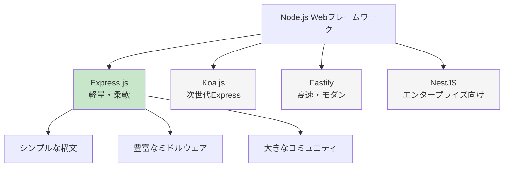

# Express.jsの導入とセットアップ

この章では、これまで学んだ知識を活用して、実践的なWebアプリケーションを作成します。Node.jsの代表的なWebフレームワークである**Express.js**を使用して、ユーザー管理機能を持つシンプルなWebアプリケーションを構築していきましょう。

## Express.jsとは

### Express.jsの概要

**Express.js**は、Node.js用の軽量で柔軟なWebアプリケーションフレームワークです。シンプルな構文で強力なWebサーバーとAPIを構築できます。

#### Express.jsの特徴

1. **ミニマルな構成**: 必要最小限の機能のみ提供
2. **柔軟なルーティング**: URLパターンの柔軟なマッチング
3. **ミドルウェアサポート**: 機能をモジュール化して組み合わせ
4. **豊富なエコシステム**: 大量のサードパーティミドルウェア
5. **高パフォーマンス**: Node.jsの非同期処理を活用

#### 用語解説：フレームワークとライブラリ
- **ライブラリ**: 特定の機能を提供するコード集（開発者が必要な時に呼び出し）
- **フレームワーク**: アプリケーションの基盤となる構造とルール（フレームワークが開発者のコードを呼び出し）

### 他の選択肢との比較



### Express.jsを選ぶ理由

**初心者におすすめの理由**:
1. **学習コストが低い**: シンプルな構文で理解しやすい
2. **豊富なドキュメント**: 公式ドキュメントとチュートリアルが充実
3. **大きなコミュニティ**: 問題解決のための情報が豊富
4. **就職市場での需要**: 多くの企業で使用されていり、実務経験になる

## Express.jsのインストールと基本設定

### 新しいプロジェクトの作成

```powershell
# プロジェクトフォルダを作成
mkdir user-management-app
cd user-management-app

# package.jsonを作成
npm init -y

# VS Codeでプロジェクトを開く
code .
```

### Express.jsのインストール

```powershell
# Express.jsと関連パッケージをインストール
npm install express

# テンプレートエンジンとユーティリティパッケージ
npm install ejs body-parser

# 開発用パッケージ
npm install --save-dev nodemon
```

#### インストールしたパッケージの説明

- **express**: メインのフレームワーク
- **ejs**: テンプレートエンジン（HTMLを動的に生成）
- **body-parser**: HTTPリクエストのボディを解析
- **nodemon**: ファイル変更時の自動再起動

#### 用語解説：テンプレートエンジン
**テンプレートエンジン**は、テンプレート（ひな形）にJavaScriptの変数やロジックを埋め込んで、動的にHTMLを生成するツールです。

### package.jsonのスクリプト設定

```json
{
  "name": "user-management-app",
  "version": "1.0.0",
  "description": "ユーザー管理Webアプリケーション",
  "main": "app.js",
  "scripts": {
    "start": "node app.js",
    "dev": "nodemon app.js",
    "test": "jest"
  },
  "keywords": ["express", "nodejs", "web-app"],
  "author": "あなたの名前",
  "license": "ISC",
  "dependencies": {
    "body-parser": "^1.20.2",
    "ejs": "^3.1.9",
    "express": "^4.18.2"
  },
  "devDependencies": {
    "nodemon": "^3.0.2"
  }
}
```

### プロジェト構造の作成

```
user-management-app/
├── app.js                  # メインアプリケーションファイル
├── package.json            # プロジェクト設定
├── routes/                 # ルーティングファイル
│   ├── index.js
│   └── users.js
├── views/                  # テンプレートファイル
│   ├── layout.ejs
│   ├── index.ejs
│   ├── users/
│   │   ├── list.ejs
│   │   ├── create.ejs
│   │   └── edit.ejs
│   └── partials/
│       ├── header.ejs
│       └── footer.ejs
├── public/                 # 静的ファイル
│   ├── css/
│   │   └── style.css
│   ├── js/
│   │   └── main.js
│   └── images/
├── middleware/             # カスタムミドルウェア
│   └── validation.js
├── models/                 # データモデル
│   └── user.js
└── utils/                  # ユーティリティ関数
    └── helpers.js
```

```powershell
# フォルダ構造を作成
mkdir routes views public middleware models utils
mkdir views\users views\partials
mkdir public\css public\js public\images
```

## 基本的なWebサーバーの作成

### メインアプリケーションファイル

```javascript
// app.js
const express = require('express');
const bodyParser = require('body-parser');
const path = require('path');

// Expressアプリケーションの作成
const app = express();
const PORT = process.env.PORT || 3000;

// ミドルウェアの設定

// 1. テンプレートエンジンの設定
app.set('view engine', 'ejs');
app.set('views', path.join(__dirname, 'views'));

// 2. 静的ファイルの配信設定
app.use(express.static(path.join(__dirname, 'public')));

// 3. ボディパーサーの設定
app.use(bodyParser.urlencoded({ extended: true }));
app.use(bodyParser.json());

// 4. リクエストログの設定
app.use((req, res, next) => {
  console.log(`${new Date().toISOString()} - ${req.method} ${req.url}`);
  next();
});

// ルーティングの設定
const indexRouter = require('./routes/index');
const usersRouter = require('./routes/users');

app.use('/', indexRouter);
app.use('/users', usersRouter);

// 404エラーハンドリング
app.use((req, res) => {
  res.status(404).render('error', { 
    title: '404 - ページが見つかりません',
    message: '要求されたページは存在しません。'
  });
});

// エラーハンドリングミドルウェア
app.use((err, req, res, next) => {
  console.error(err.stack);
  res.status(500).render('error', {
    title: '500 - サーバーエラー',
    message: 'サーバーでエラーが発生しました。'
  });
});

// サーバーの起動
app.listen(PORT, () => {
  console.log(`サーバーがポート ${PORT} で起動しました`);
  console.log(`http://localhost:${PORT} でアクセスできます`);
});

module.exports = app;
```

#### 用語解説：ミドルウェア
**ミドルウェア**は、HTTPリクエストがサーバーに届いてからレスポンスが返されるまでの間に実行される関数です。ログ出力、認証、データ解析などの機能を提供します。

### ルーティングの実装

#### メインページルーター

```javascript
// routes/index.js
const express = require('express');
const router = express.Router();

// メインページ
router.get('/', (req, res) => {
  res.render('index', {
    title: 'ユーザー管理アプリケーション',
    message: 'ユーザー管理システムへようこそ！'
  });
});

// API情報エンドポイント
router.get('/api/info', (req, res) => {
  res.json({
    name: 'ユーザー管理API',
    version: '1.0.0',
    description: 'Node.js Expressで作成したユーザー管理システム',
    endpoints: {
      users: '/users',
      createUser: '/users/create',
      editUser: '/users/:id/edit'
    },
    timestamp: new Date().toISOString()
  });
});

module.exports = router;
```

#### ユーザー管理ルーター

```javascript
// routes/users.js
const express = require('express');
const router = express.Router();
const User = require('../models/user');

// ユーザー一覧ページ
router.get('/', async (req, res) => {
  try {
    const users = await User.getAll();
    res.render('users/list', {
      title: 'ユーザー一覧',
      users: users
    });
  } catch (error) {
    console.error('ユーザー一覧取得エラー:', error);
    res.status(500).render('error', {
      title: 'エラー',
      message: 'ユーザー一覧の取得に失敗しました。'
    });
  }
});

// ユーザー作成フォーム表示
router.get('/create', (req, res) => {
  res.render('users/create', {
    title: '新しいユーザーの作成'
  });
});

// ユーザー作成処理
router.post('/create', async (req, res) => {
  try {
    const { name, email, age } = req.body;
    
    // バリデーション
    if (!name || !email) {
      return res.status(400).render('users/create', {
        title: '新しいユーザーの作成',
        error: '名前とメールアドレスは必須です。',
        formData: req.body
      });
    }
    
    const newUser = await User.create({ name, email, age: parseInt(age) || null });
    res.redirect('/users');
  } catch (error) {
    console.error('ユーザー作成エラー:', error);
    res.status(500).render('users/create', {
      title: '新しいユーザーの作成',
      error: 'ユーザーの作成に失敗しました。',
      formData: req.body
    });
  }
});

// ユーザー編集フォーム表示
router.get('/:id/edit', async (req, res) => {
  try {
    const user = await User.getById(parseInt(req.params.id));
    if (!user) {
      return res.status(404).render('error', {
        title: 'ユーザーが見つかりません',
        message: '指定されたユーザーは存在しません。'
      });
    }
    
    res.render('users/edit', {
      title: 'ユーザー編集',
      user: user
    });
  } catch (error) {
    console.error('ユーザー取得エラー:', error);
    res.status(500).render('error', {
      title: 'エラー',
      message: 'ユーザー情報の取得に失敗しました。'
    });
  }
});

// ユーザー更新処理
router.post('/:id/edit', async (req, res) => {
  try {
    const userId = parseInt(req.params.id);
    const { name, email, age } = req.body;
    
    // バリデーション
    if (!name || !email) {
      const user = await User.getById(userId);
      return res.status(400).render('users/edit', {
        title: 'ユーザー編集',
        error: '名前とメールアドレスは必須です。',
        user: { ...user, ...req.body }
      });
    }
    
    await User.update(userId, { name, email, age: parseInt(age) || null });
    res.redirect('/users');
  } catch (error) {
    console.error('ユーザー更新エラー:', error);
    res.status(500).render('error', {
      title: 'エラー',
      message: 'ユーザー情報の更新に失敗しました。'
    });
  }
});

// ユーザー削除処理
router.post('/:id/delete', async (req, res) => {
  try {
    await User.delete(parseInt(req.params.id));
    res.redirect('/users');
  } catch (error) {
    console.error('ユーザー削除エラー:', error);
    res.status(500).render('error', {
      title: 'エラー',
      message: 'ユーザーの削除に失敗しました。'
    });
  }
});

// APIエンドポイント: ユーザー一覧をJSONで返却
router.get('/api', async (req, res) => {
  try {
    const users = await User.getAll();
    res.json({
      success: true,
      data: users,
      count: users.length
    });
  } catch (error) {
    res.status(500).json({
      success: false,
      error: 'Failed to fetch users'
    });
  }
});

module.exports = router;
```

#### 用語解説：HTTPメソッド
- **GET**: データの取得（ページ表示、情報取得）
- **POST**: データの送信（フォーム送信、データ作成）
- **PUT**: データの更新（全体更新）
- **DELETE**: データの削除

## データモデルの作成

### ユーザーモデル

```javascript
// models/user.js
/**
 * ユーザーデータモデル
 * 簡単なメモリベースのデータストア（実際のプロジェクトではデータベースを使用）
 */

class User {
  constructor(id, name, email, age = null, createdAt = new Date()) {
    this.id = id;
    this.name = name;
    this.email = email;
    this.age = age;
    this.createdAt = createdAt;
    this.updatedAt = new Date();
  }
  
  // ユーザー情報をJSON形式で返却
  toJSON() {
    return {
      id: this.id,
      name: this.name,
      email: this.email,
      age: this.age,
      createdAt: this.createdAt,
      updatedAt: this.updatedAt
    };
  }
  
  // メールアドレスのバリデーション
  static isValidEmail(email) {
    const emailRegex = /^[^\s@]+@[^\s@]+\.[^\s@]+$/;
    return emailRegex.test(email);
  }
}

// メモリストレージ（簡単なデモンストレーション用）
let users = [
  new User(1, '田中太郎', 'tanaka@example.com', 25),
  new User(2, '佐藤花子', 'sato@example.com', 30),
  new User(3, '鈴木一郎', 'suzuki@example.com', 28)
];
let nextId = 4;

// ユーザー操作用の静的メソッド
class UserModel {
  
  // 全ユーザーを取得
  static async getAll() {
    // データベースアクセスを模擬するための遅延
    await new Promise(resolve => setTimeout(resolve, 10));
    return users.map(user => user.toJSON());
  }
  
  // IDでユーザーを取得
  static async getById(id) {
    await new Promise(resolve => setTimeout(resolve, 10));
    const user = users.find(u => u.id === id);
    return user ? user.toJSON() : null;
  }
  
  // メールアドレスでユーザーを取得
  static async getByEmail(email) {
    await new Promise(resolve => setTimeout(resolve, 10));
    const user = users.find(u => u.email.toLowerCase() === email.toLowerCase());
    return user ? user.toJSON() : null;
  }
  
  // 新しいユーザーを作成
  static async create(userData) {
    await new Promise(resolve => setTimeout(resolve, 10));
    
    // バリデーション
    if (!userData.name || !userData.email) {
      throw new Error('名前とメールアドレスは必須です');
    }
    
    if (!User.isValidEmail(userData.email)) {
      throw new Error('有効なメールアドレスを入力してください');
    }
    
    // メールアドレスの重複チェック
    const existingUser = await this.getByEmail(userData.email);
    if (existingUser) {
      throw new Error('このメールアドレスは既に使用されています');
    }
    
    const newUser = new User(
      nextId++,
      userData.name.trim(),
      userData.email.trim().toLowerCase(),
      userData.age
    );
    
    users.push(newUser);
    return newUser.toJSON();
  }
  
  // ユーザー情報を更新
  static async update(id, userData) {
    await new Promise(resolve => setTimeout(resolve, 10));
    
    const userIndex = users.findIndex(u => u.id === id);
    if (userIndex === -1) {
      throw new Error('ユーザーが見つかりません');
    }
    
    // バリデーション
    if (userData.email && !User.isValidEmail(userData.email)) {
      throw new Error('有効なメールアドレスを入力してください');
    }
    
    // メールアドレスの重複チェック（自分以外）
    if (userData.email) {
      const existingUser = await this.getByEmail(userData.email);
      if (existingUser && existingUser.id !== id) {
        throw new Error('このメールアドレスは既に使用されています');
      }
    }
    
    const user = users[userIndex];
    
    // フィールドを更新
    if (userData.name !== undefined) user.name = userData.name.trim();
    if (userData.email !== undefined) user.email = userData.email.trim().toLowerCase();
    if (userData.age !== undefined) user.age = userData.age;
    user.updatedAt = new Date();
    
    return user.toJSON();
  }
  
  // ユーザーを削除
  static async delete(id) {
    await new Promise(resolve => setTimeout(resolve, 10));
    
    const userIndex = users.findIndex(u => u.id === id);
    if (userIndex === -1) {
      throw new Error('ユーザーが見つかりません');
    }
    
    const deletedUser = users.splice(userIndex, 1)[0];
    return deletedUser.toJSON();
  }
  
  // ユーザー数を取得
  static async getCount() {
    await new Promise(resolve => setTimeout(resolve, 10));
    return users.length;
  }
  
  // ユーザーを検索（名前またはメールで部分マッチ）
  static async search(query) {
    await new Promise(resolve => setTimeout(resolve, 10));
    
    if (!query || query.trim() === '') {
      return this.getAll();
    }
    
    const searchTerm = query.toLowerCase().trim();
    const matchedUsers = users.filter(user => 
      user.name.toLowerCase().includes(searchTerm) ||
      user.email.toLowerCase().includes(searchTerm)
    );
    
    return matchedUsers.map(user => user.toJSON());
  }
}

module.exports = UserModel;
```

#### 用語解説：モデル（Model）
**モデル**は、アプリケーションのデータとビジネスロジックを管理する層です。データベースとのやり取り、データのバリデーション、ビジネスルールの実装などを担当します。

## テンプレートの作成

### レイアウトテンプレート

```html
<!-- views/layout.ejs -->
<!DOCTYPE html>
<html lang="ja">
<head>
    <meta charset="UTF-8">
    <meta name="viewport" content="width=device-width, initial-scale=1.0">
    <title><%= title %> - ユーザー管理アプリ</title>
    <link href="https://cdn.jsdelivr.net/npm/bootstrap@5.1.3/dist/css/bootstrap.min.css" rel="stylesheet">
    <link rel="stylesheet" href="/css/style.css">
</head>
<body>
    <nav class="navbar navbar-expand-lg navbar-dark bg-dark">
        <div class="container">
            <a class="navbar-brand" href="/">ユーザー管理アプリ</a>
            <button class="navbar-toggler" type="button" data-bs-toggle="collapse" data-bs-target="#navbarNav">
                <span class="navbar-toggler-icon"></span>
            </button>
            <div class="collapse navbar-collapse" id="navbarNav">
                <ul class="navbar-nav ms-auto">
                    <li class="nav-item">
                        <a class="nav-link" href="/">ホーム</a>
                    </li>
                    <li class="nav-item">
                        <a class="nav-link" href="/users">ユーザー一覧</a>
                    </li>
                    <li class="nav-item">
                        <a class="nav-link" href="/users/create">ユーザー作成</a>
                    </li>
                </ul>
            </div>
        </div>
    </nav>

    <main class="container mt-4">
        <% if (typeof error !== 'undefined' && error) { %>
            <div class="alert alert-danger" role="alert">
                <%= error %>
            </div>
        <% } %>
        
        <% if (typeof success !== 'undefined' && success) { %>
            <div class="alert alert-success" role="alert">
                <%= success %>
            </div>
        <% } %>

        <%- body %>
    </main>

    <footer class="bg-dark text-light text-center py-3 mt-5">
        <div class="container">
            <p>&copy; 2024 ユーザー管理アプリ. Made with Node.js & Express</p>
        </div>
    </footer>

    <script src="https://cdn.jsdelivr.net/npm/bootstrap@5.1.3/dist/js/bootstrap.bundle.min.js"></script>
    <script src="/js/main.js"></script>
</body>
</html>
```

### メインページテンプレート

```html
<!-- views/index.ejs -->
<div class="jumbotron bg-light p-5 rounded">
    <h1 class="display-4"><%= title %></h1>
    <p class="lead"><%= message %></p>
    <hr class="my-4">
    <p>このアプリケーションでは、ユーザーの作成、編集、削除ができます。</p>
    <a class="btn btn-primary btn-lg" href="/users" role="button">ユーザー一覧を見る</a>
    <a class="btn btn-success btn-lg" href="/users/create" role="button">新しいユーザーを作成</a>
</div>

<div class="row mt-4">
    <div class="col-md-4">
        <div class="card">
            <div class="card-body">
                <h5 class="card-title">ユーザー管理</h5>
                <p class="card-text">ユーザーの作成、編集、削除ができます。</p>
                <a href="/users" class="btn btn-outline-primary">詳細を見る</a>
            </div>
        </div>
    </div>
    <div class="col-md-4">
        <div class="card">
            <div class="card-body">
                <h5 class="card-title">API情報</h5>
                <p class="card-text">アプリケーションのAPI情報を確認できます。</p>
                <a href="/api/info" class="btn btn-outline-info" target="_blank">API情報</a>
            </div>
        </div>
    </div>
    <div class="col-md-4">
        <div class="card">
            <div class="card-body">
                <h5 class="card-title">ユーザーAPI</h5>
                <p class="card-text">ユーザーデータをJSON形式で取得できます。</p>
                <a href="/users/api" class="btn btn-outline-warning" target="_blank">ユーザーAPI</a>
            </div>
        </div>
    </div>
</div>

<div class="mt-5">
    <h3>最近の更新</h3>
    <ul class="list-group">
        <li class="list-group-item d-flex justify-content-between align-items-center">
            ユーザー管理機能を実装しました
            <span class="badge bg-primary rounded-pill">New</span>
        </li>
        <li class="list-group-item d-flex justify-content-between align-items-center">
            APIエンドポイントを追加しました
            <span class="badge bg-secondary rounded-pill">API</span>
        </li>
        <li class="list-group-item d-flex justify-content-between align-items-center">
            レスポンシブデザインに対応しました
            <span class="badge bg-success rounded-pill">UI</span>
        </li>
    </ul>
</div>
```

### ユーザー一覧テンプレート

```html
<!-- views/users/list.ejs -->
<div class="d-flex justify-content-between align-items-center mb-4">
    <h2><%= title %></h2>
    <a href="/users/create" class="btn btn-primary">
        <i class="fas fa-plus"></i> 新しいユーザーを作成
    </a>
</div>

<% if (users.length === 0) { %>
    <div class="alert alert-info text-center" role="alert">
        <h4>ユーザーがいません</h4>
        <p>新しいユーザーを作成してください。</p>
        <a href="/users/create" class="btn btn-primary">ユーザー作成</a>
    </div>
<% } else { %>
    <div class="table-responsive">
        <table class="table table-striped table-hover">
            <thead class="table-dark">
                <tr>
                    <th>ID</th>
                    <th>名前</th>
                    <th>メールアドレス</th>
                    <th>年齢</th>
                    <th>作成日</th>
                    <th>操作</th>
                </tr>
            </thead>
            <tbody>
                <% users.forEach(user => { %>
                    <tr>
                        <td><%= user.id %></td>
                        <td><%= user.name %></td>
                        <td><%= user.email %></td>
                        <td><%= user.age || '-' %></td>
                        <td><%= new Date(user.createdAt).toLocaleDateString('ja-JP') %></td>
                        <td>
                            <div class="btn-group" role="group">
                                <a href="/users/<%= user.id %>/edit" class="btn btn-sm btn-outline-primary">
                                    <i class="fas fa-edit"></i> 編集
                                </a>
                                <button type="button" class="btn btn-sm btn-outline-danger" 
                                        onclick="deleteUser(<%= user.id %>, '<%= user.name %>')">
                                    <i class="fas fa-trash"></i> 削除
                                </button>
                            </div>
                        </td>
                    </tr>
                <% }) %>
            </tbody>
        </table>
    </div>
    
    <div class="mt-3">
        <p class="text-muted">総ユーザー数: <%= users.length %>人</p>
    </div>
<% } %>

<!-- 削除確認モーダル -->
<div class="modal fade" id="deleteModal" tabindex="-1">
    <div class="modal-dialog">
        <div class="modal-content">
            <div class="modal-header">
                <h5 class="modal-title">ユーザー削除の確認</h5>
                <button type="button" class="btn-close" data-bs-dismiss="modal"></button>
            </div>
            <div class="modal-body">
                <p id="deleteMessage"></p>
                <div class="alert alert-warning">
                    <strong>注意:</strong> この操作は元に戻せません。
                </div>
            </div>
            <div class="modal-footer">
                <button type="button" class="btn btn-secondary" data-bs-dismiss="modal">キャンセル</button>
                <form id="deleteForm" method="POST" style="display: inline;">
                    <button type="submit" class="btn btn-danger">削除する</button>
                </form>
            </div>
        </div>
    </div>
</div>

<script>
function deleteUser(userId, userName) {
    document.getElementById('deleteMessage').textContent = 
        `「${userName}」を削除しますか？`;
    document.getElementById('deleteForm').action = `/users/${userId}/delete`;
    
    const modal = new bootstrap.Modal(document.getElementById('deleteModal'));
    modal.show();
}
</script>
```

### ユーザー作成テンプレート

```html
<!-- views/users/create.ejs -->
<div class="row justify-content-center">
    <div class="col-md-8">
        <div class="card">
            <div class="card-header">
                <h3 class="mb-0"><%= title %></h3>
            </div>
            <div class="card-body">
                <form method="POST" action="/users/create" novalidate>
                    <div class="mb-3">
                        <label for="name" class="form-label">名前 <span class="text-danger">*</span></label>
                        <input type="text" 
                               class="form-control <%= (typeof formData !== 'undefined' && formData.name && !formData.name.trim()) ? 'is-invalid' : '' %>" 
                               id="name" 
                               name="name" 
                               value="<%= (typeof formData !== 'undefined' && formData.name) ? formData.name : '' %>" 
                               required>
                        <div class="invalid-feedback">
                            名前を入力してください。
                        </div>
                    </div>
                    
                    <div class="mb-3">
                        <label for="email" class="form-label">メールアドレス <span class="text-danger">*</span></label>
                        <input type="email" 
                               class="form-control <%= (typeof formData !== 'undefined' && formData.email && !formData.email.trim()) ? 'is-invalid' : '' %>" 
                               id="email" 
                               name="email" 
                               value="<%= (typeof formData !== 'undefined' && formData.email) ? formData.email : '' %>" 
                               required>
                        <div class="invalid-feedback">
                            有効なメールアドレスを入力してください。
                        </div>
                    </div>
                    
                    <div class="mb-3">
                        <label for="age" class="form-label">年齢 (任意)</label>
                        <input type="number" 
                               class="form-control" 
                               id="age" 
                               name="age" 
                               min="0" 
                               max="150" 
                               value="<%= (typeof formData !== 'undefined' && formData.age) ? formData.age : '' %>">
                        <div class="form-text">
                            0以上150以下の数値を入力してください。
                        </div>
                    </div>
                    
                    <div class="d-grid gap-2 d-md-flex justify-content-md-end">
                        <a href="/users" class="btn btn-secondary me-md-2">キャンセル</a>
                        <button type="submit" class="btn btn-primary">作成する</button>
                    </div>
                </form>
            </div>
        </div>
    </div>
</div>

<script>
// クライアントサイドバリデーション
(function() {
    'use strict';
    
    const form = document.querySelector('form');
    
    form.addEventListener('submit', function(event) {
        if (!form.checkValidity()) {
            event.preventDefault();
            event.stopPropagation();
        }
        
        form.classList.add('was-validated');
    });
})();
</script>
```

### エラーページテンプレート

```html
<!-- views/error.ejs -->
<div class="text-center">
    <div class="error-page">
        <h1 class="display-1 text-muted">:(</h1>
        <h2><%= title %></h2>
        <p class="lead"><%= message %></p>
        
        <div class="mt-4">
            <a href="/" class="btn btn-primary">ホームに戻る</a>
            <a href="/users" class="btn btn-outline-secondary">ユーザー一覧</a>
        </div>
    </div>
</div>

<style>
.error-page {
    padding: 2rem 0;
}

.error-page h1 {
    font-size: 8rem;
    font-weight: bold;
}
</style>
```

## 静的ファイルの作成

### CSSスタイル

```css
/* public/css/style.css */

/* 全体の基本スタイル */
body {
    font-family: 'Segoe UI', Tahoma, Geneva, Verdana, sans-serif;
    line-height: 1.6;
    background-color: #f8f9fa;
}

/* ナビゲーション */
.navbar-brand {
    font-weight: bold;
    font-size: 1.5rem;
}

/* カードスタイル */
.card {
    border: none;
    box-shadow: 0 0.125rem 0.25rem rgba(0, 0, 0, 0.075);
    transition: box-shadow 0.15s ease-in-out;
}

.card:hover {
    box-shadow: 0 0.5rem 1rem rgba(0, 0, 0, 0.15);
}

/* テーブルスタイル */
.table-hover tbody tr:hover {
    background-color: rgba(0, 123, 255, 0.1);
}

/* ボタングループ */
.btn-group .btn {
    margin-right: 0.25rem;
}

.btn-group .btn:last-child {
    margin-right: 0;
}

/* フォームスタイル */
.form-control:focus {
    border-color: #80bdff;
    box-shadow: 0 0 0 0.2rem rgba(0, 123, 255, 0.25);
}

.was-validated .form-control:valid {
    border-color: #28a745;
}

.was-validated .form-control:invalid {
    border-color: #dc3545;
}

/* ジャンボトロンスタイル */
.jumbotron {
    background: linear-gradient(135deg, #667eea 0%, #764ba2 100%);
    color: white;
    margin-bottom: 2rem;
}

.jumbotron h1 {
    text-shadow: 2px 2px 4px rgba(0,0,0,0.3);
}

/* アラートスタイル */
.alert {
    border: none;
    border-radius: 0.5rem;
}

/* フッター */
footer {
    margin-top: auto;
}

/* レスポンシブデザイン */
@media (max-width: 768px) {
    .jumbotron {
        padding: 2rem 1rem;
    }
    
    .jumbotron h1 {
        font-size: 2rem;
    }
    
    .table-responsive {
        font-size: 0.875rem;
    }
    
    .btn-group {
        display: flex;
        flex-direction: column;
        width: 100%;
    }
    
    .btn-group .btn {
        margin-bottom: 0.25rem;
        margin-right: 0;
    }
}

/* ローディングアニメーション */
.loading {
    display: inline-block;
    width: 20px;
    height: 20px;
    border: 3px solid rgba(255,255,255,.3);
    border-radius: 50%;
    border-top-color: #fff;
    animation: spin 1s ease-in-out infinite;
}

@keyframes spin {
    to { transform: rotate(360deg); }
}

/* フェードインアニメーション */
.fade-in {
    animation: fadeIn 0.5s ease-in;
}

@keyframes fadeIn {
    from { opacity: 0; transform: translateY(20px); }
    to { opacity: 1; transform: translateY(0); }
}
```

### JavaScriptファイル

```javascript
// public/js/main.js

/**
 * メインJavaScriptファイル
 * クライアントサイドの動的機能を提供
 */

// DOMが読み込まれた後に実行
document.addEventListener('DOMContentLoaded', function() {
    // フェードインアニメーションを適用
    document.body.classList.add('fade-in');
    
    // アラートの自動非表示
    setupAutoHideAlerts();
    
    // フォームバリデーションのセットアップ
    setupFormValidation();
    
    // テーブルのソート機能
    setupTableSorting();
    
    // フォーム送信時のローディング表示
    setupLoadingStates();
});

/**
 * アラートの自動非表示設定
 */
function setupAutoHideAlerts() {
    const alerts = document.querySelectorAll('.alert:not(.alert-danger)');
    
    alerts.forEach(alert => {
        // 5秒後にフェードアウト
        setTimeout(() => {
            alert.style.transition = 'opacity 0.5s ease-out';
            alert.style.opacity = '0';
            
            // アニメーション完了後に要素を削除
            setTimeout(() => {
                alert.remove();
            }, 500);
        }, 5000);
    });
}

/**
 * フォームバリデーションのセットアップ
 */
function setupFormValidation() {
    const forms = document.querySelectorAll('form[novalidate]');
    
    forms.forEach(form => {
        form.addEventListener('submit', function(event) {
            if (!form.checkValidity()) {
                event.preventDefault();
                event.stopPropagation();
                
                // 最初のエラーフィールドにフォーカス
                const firstError = form.querySelector('.form-control:invalid');
                if (firstError) {
                    firstError.focus();
                }
            }
            
            form.classList.add('was-validated');
        });
        
        // リアルタイムバリデーション
        const inputs = form.querySelectorAll('.form-control');
        inputs.forEach(input => {
            input.addEventListener('blur', function() {
                if (form.classList.contains('was-validated')) {
                    this.classList.toggle('is-valid', this.checkValidity());
                    this.classList.toggle('is-invalid', !this.checkValidity());
                }
            });
        });
    });
}

/**
 * テーブルのソート機能のセットアップ
 */
function setupTableSorting() {
    const tables = document.querySelectorAll('table.table');
    
    tables.forEach(table => {
        const headers = table.querySelectorAll('thead th');
        
        headers.forEach((header, index) => {
            // 操作列はソート対象外
            if (header.textContent.includes('操作')) return;
            
            header.style.cursor = 'pointer';
            header.style.userSelect = 'none';
            
            header.addEventListener('click', () => {
                sortTable(table, index);
            });
        });
    });
}

/**
 * テーブルソート機能
 */
function sortTable(table, columnIndex) {
    const tbody = table.querySelector('tbody');
    const rows = Array.from(tbody.querySelectorAll('tr'));
    const header = table.querySelectorAll('thead th')[columnIndex];
    
    // 現在のソート方向を取得
    const currentSort = header.dataset.sort || 'asc';
    const newSort = currentSort === 'asc' ? 'desc' : 'asc';
    
    // 他のヘッダーからソート情報を削除
    table.querySelectorAll('thead th').forEach(th => {
        delete th.dataset.sort;
        th.innerHTML = th.innerHTML.replace(/ ▲| ▼/g, '');
    });
    
    // 新しいソート方向を設定
    header.dataset.sort = newSort;
    header.innerHTML += newSort === 'asc' ? ' ▲' : ' ▼';
    
    // 行をソート
    rows.sort((a, b) => {
        const aValue = a.cells[columnIndex].textContent.trim();
        const bValue = b.cells[columnIndex].textContent.trim();
        
        // 数値かどうかを判定
        const aNum = parseFloat(aValue);
        const bNum = parseFloat(bValue);
        
        if (!isNaN(aNum) && !isNaN(bNum)) {
            return newSort === 'asc' ? aNum - bNum : bNum - aNum;
        } else {
            return newSort === 'asc' ? 
                aValue.localeCompare(bValue, 'ja') : 
                bValue.localeCompare(aValue, 'ja');
        }
    });
    
    // ソートされた行をテーブルに再適用
    rows.forEach(row => tbody.appendChild(row));
}

/**
 * フォーム送信時のローディング表示
 */
function setupLoadingStates() {
    const forms = document.querySelectorAll('form');
    
    forms.forEach(form => {
        form.addEventListener('submit', function() {
            const submitButton = form.querySelector('button[type="submit"]');
            
            if (submitButton) {
                const originalText = submitButton.innerHTML;
                submitButton.innerHTML = '<span class="loading"></span> 処理中...';
                submitButton.disabled = true;
                
                // エラーが発生した場合のためのタイマー
                setTimeout(() => {
                    submitButton.innerHTML = originalText;
                    submitButton.disabled = false;
                }, 10000);
            }
        });
    });
}

/**
 * ユーティリティ関数
 */

// トーストメッセージを表示
function showToast(message, type = 'info') {
    const toast = document.createElement('div');
    toast.className = `alert alert-${type} position-fixed`;
    toast.style.cssText = `
        top: 20px;
        right: 20px;
        z-index: 9999;
        max-width: 300px;
        opacity: 0;
        transition: opacity 0.3s ease-in-out;
    `;
    toast.textContent = message;
    
    document.body.appendChild(toast);
    
    // フェードイン
    setTimeout(() => {
        toast.style.opacity = '1';
    }, 100);
    
    // 自動削除
    setTimeout(() => {
        toast.style.opacity = '0';
        setTimeout(() => {
            toast.remove();
        }, 300);
    }, 3000);
}

// 確認ダイアログ
function confirmDialog(message, callback) {
    if (confirm(message)) {
        callback();
    }
}
```

## アプリケーションの起動とテスト

### アプリケーションの起動

```powershell
# 開発モードで起動（ファイル変更時に自動再起動）
npm run dev

# 本番モードで起動
npm start
```

ブラウザで `http://localhost:3000` にアクセスして動作確認してください。

### 機能テスト

**テストすべき機能**:
1. **メインページ表示** (`/`)
2. **ユーザー一覧表示** (`/users`)
3. **ユーザー作成** (`/users/create`)
4. **ユーザー編集** (`/users/:id/edit`)
5. **ユーザー削除** (`/users/:id/delete`)
6. **APIエンドポイント** (`/api/info`, `/users/api`)
7. **エラーハンドリング** (404, 500エラー)

### デバッグ手順

#### VS Codeでのデバッグ設定

```json
// .vscode/launch.json
{
  "version": "0.2.0",
  "configurations": [
    {
      "type": "node",
      "request": "launch",
      "name": "Launch App",
      "skipFiles": ["<node_internals>/**"],
      "program": "${workspaceFolder}/app.js",
      "env": {
        "NODE_ENV": "development"
      },
      "console": "integratedTerminal"
    },
    {
      "type": "node",
      "request": "attach",
      "name": "Attach to Process",
      "port": 9229,
      "skipFiles": ["<node_internals>/**"]
    }
  ]
}
```

#### ブレークポイントの設定例

```javascript
// ユーザー作成処理のデバッグポイント
router.post('/create', async (req, res) => {
  try {
    const { name, email, age } = req.body;  // ← ブレークポイント設定
    
    // バリデーション
    if (!name || !email) {  // ← 条件付きブレークポイント
      return res.status(400).render('users/create', {
        title: '新しいユーザーの作成',
        error: '名前とメールアドレスは必須です。',
        formData: req.body
      });
    }
    
    const newUser = await User.create({ name, email, age: parseInt(age) || null });
    res.redirect('/users');
  } catch (error) {
    console.error('ユーザー作成エラー:', error);  // ← ログポイント
    // ... エラー処理
  }
});
```

## まとめ

この章では、Express.jsを使った実践的なWebアプリケーションの作成方法を学習しました。

**重要なポイント**:

1. **Express.js の基本構造**
   - ミドルウェアの活用
   - ルーティングの実装
   - エラーハンドリング

2. **MVCアーキテクチャ**
   - Model: データモデルとビジネスロジック
   - View: EJSテンプレートエンジン
   - Controller: ルーティングロジック

3. **実践的な機能実装**
   - CRUD操作（Create, Read, Update, Delete）
   - フォームバリデーション
   - レスポンシブデザイン

4. **フロントエンド連携**
   - BootstrapによるUI構築
   - JavaScriptでのインタラクティブ機能
   - APIエンドポイントの提供

5. **デバッグとテスト**
   - VS Codeデバッグ機能の活用
   - エラーハンドリングの実装
   - ログ出力と監視

次の章では、開発効率を向上させるためのツールとワークフローを学習します。これまで作成したアプリケーションをさらに改善し、プロフェッショナルな開発環境を構築していきましょう。

## 用語集

| 用語 | 説明 |
|------|---------|
| フレームワーク | アプリケーションの基盤となる構造とルール |
| ライブラリ | 特定の機能を提供するコード集 |
| テンプレートエンジン | テンプレートに変数やロジックを埋め込んでHTMLを生成するツール |
| ミドルウェア | リクエストからレスポンスまでの間に実行される関数 |
| HTTPメソッド | GET(取得)、POST(送信)、PUT(更新)、DELETE(削除)など |
| モデル | データとビジネスロジックを管理する層 |