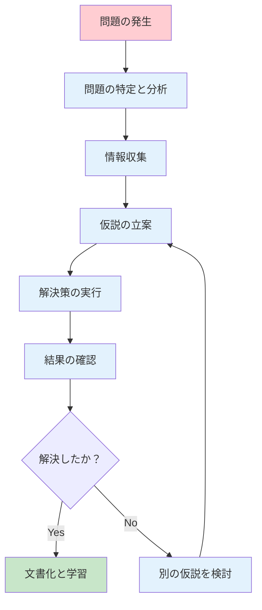

# よくある問題とその対処法

この章では、Node.js開発において遭遇しやすい問題とその解決方法、そして長期的な開発を支えるメンテナンス手法について学習します。問題が発生した際の体系的なアプローチと、問題を予防するためのベストプラクティスを身につけましょう。

## トラブルシューティングの基本アプローチ

### 問題解決の基本手順

効率的な問題解決には、以下の体系的なアプローチが重要です：



#### 用語解説：トラブルシューティング
**トラブルシューティング**とは、システムやアプリケーションで発生した問題を体系的に特定し、解決する手法です。効率的な問題解決にはプロセス化が重要です。

### ログとエラーメッセージの読み方

#### エラーメッセージの構造

```javascript
// エラー例
Error: Cannot find module 'express'
    at Function.Module._resolveFilename (internal/modules/cjs/loader.js:889:15)
    at Function.Module._load (internal/modules/cjs/loader.js:745:27)
    at Module.require (internal/modules/cjs/loader.js:961:19)
    at require (internal/modules/cjs/helpers.js:92:18)
    at Object.<anonymous> (/path/to/app.js:1:17)
    at Module._compile (internal/modules/cjs/loader.js:1072:14)
    at Object.Module._extensions..js (internal/modules/cjs/loader.js:1101:10)
    at Module.load (internal/modules/cjs/loader.js:937:32)
    at Function.Module._load (internal/modules/cjs/loader.js:778:12)
    at Function.executeUserEntryPoint [as runMain] (internal/modules/run_main.js:76:12)
```

**エラーメッセージの読み方**：

1. **エラータイプ**: `Error:` - エラーの種類
2. **エラーメッセージ**: `Cannot find module 'express'` - 問題の説明
3. **スタックトレース**: ファイル名と行番号で問題の発生箇所を特定

#### 用語解説：スタックトレース
**スタックトレース**は、エラーが発生した際の関数呼び出しの履歴です。どのファイルのどの行でエラーが発生したかを特定できます。

### デバッグ情報の収集

#### 環境情報の取得

```javascript
// debug-info.js
const os = require('os');
const fs = require('fs');

/**
 * デバッグに必要な環境情報を収集
 */
function collectDebugInfo() {
  const info = {
    timestamp: new Date().toISOString(),
    system: {
      platform: process.platform,
      arch: process.arch,
      nodeVersion: process.version,
      npmVersion: null // 後で取得
    },
    process: {
      pid: process.pid,
      cwd: process.cwd(),
      argv: process.argv,
      env: {
        NODE_ENV: process.env.NODE_ENV,
        PATH: process.env.PATH?.substring(0, 200) + '...' // 長すぎる場合は省略
      }
    },
    memory: process.memoryUsage(),
    uptime: process.uptime()
  };

  // package.json の情報を取得
  try {
    const packageJson = JSON.parse(fs.readFileSync('package.json', 'utf8'));
    info.project = {
      name: packageJson.name,
      version: packageJson.version,
      dependencies: Object.keys(packageJson.dependencies || {}),
      devDependencies: Object.keys(packageJson.devDependencies || {})
    };
  } catch (error) {
    info.project = { error: 'package.json not found or invalid' };
  }

  return info;
}

/**
 * デバッグ情報をファイルに出力
 */
function saveDebugInfo() {
  const info = collectDebugInfo();
  const filename = `debug-info-${Date.now()}.json`;
  
  fs.writeFileSync(filename, JSON.stringify(info, null, 2));
  console.log(`デバッグ情報を ${filename} に保存しました`);
  
  return filename;
}

module.exports = {
  collectDebugInfo,
  saveDebugInfo
};

// 直接実行された場合は情報を出力
if (require.main === module) {
  console.log('=== 環境情報 ===');
  console.log(JSON.stringify(collectDebugInfo(), null, 2));
}
```

## Node.js 関連の問題

### インストールとセットアップの問題

#### 問題1: Node.js が認識されない

**症状**:
```
'node' は、内部コマンドまたは外部コマンド、
操作可能なプログラムまたはバッチ ファイルとして認識されていません。
```

**原因と解決方法**:

1. **Node.js がインストールされていない**
```powershell
# Node.js のバージョン確認
node --version
npm --version

# インストールされていない場合は再インストール
```

2. **PATH 環境変数の問題**
```powershell
# 環境変数の確認
echo $env:PATH

# Node.js のインストールパスを確認
where node
```

**解決手順**:
```powershell
# 1. PowerShell を管理者権限で起動
# 2. 環境変数の再読み込み
$env:Path = [System.Environment]::GetEnvironmentVariable("Path","Machine") + ";" + [System.Environment]::GetEnvironmentVariable("Path","User")

# 3. PowerShell を再起動
# 4. Node.js を再インストール（必要に応じて）
```

#### 問題2: npm install が失敗する

**症状**:
```
npm ERR! network request to https://registry.npmjs.org/... failed
npm ERR! network timeout
```

**原因と解決方法**:

1. **ネットワーク接続の問題**
```powershell
# レジストリの確認
npm config get registry

# レジストリの変更（必要に応じて）
npm config set registry https://registry.npmjs.org/
```

2. **npm キャッシュの問題**
```powershell
# キャッシュのクリア
npm cache clean --force

# npm の再インストール
npm install -g npm@latest
```

3. **プロキシ設定の問題**
```powershell
# プロキシ設定の確認
npm config get proxy
npm config get https-proxy

# プロキシの設定（企業環境の場合）
npm config set proxy http://proxy.company.com:8080
npm config set https-proxy http://proxy.company.com:8080
```

#### 問題3: バージョンの不整合

**症状**:
```
npm WARN engine package@1.0.0: wanted: {"node":">=14.0.0"} (current: {"node":"12.18.3","npm":"6.14.6"})
```

**解決方法**:

1. **Node.js バージョンの確認と更新**
```powershell
# 現在のバージョン確認
node --version
npm --version

# nvm-windows を使用したバージョン管理
nvm list available
nvm install 20.11.0
nvm use 20.11.0
```

2. **package.json での Engine 指定**
```json
{
  "engines": {
    "node": ">=18.0.0",
    "npm": ">=9.0.0"
  }
}
```

### パッケージ管理の問題

#### 問題4: モジュールが見つからない

**症状**:
```javascript
Error: Cannot find module 'lodash'
    at Function.Module._resolveFilename
```

**診断と解決**:

```javascript
// module-checker.js
const fs = require('fs');
const path = require('path');

/**
 * モジュールの存在確認
 */
function checkModule(moduleName) {
  const checks = {
    packageJsonExists: false,
    moduleInDependencies: false,
    moduleInDevDependencies: false,
    nodeModulesExists: false,
    moduleInstalled: false
  };

  // package.json の確認
  try {
    const packageJson = JSON.parse(fs.readFileSync('package.json', 'utf8'));
    checks.packageJsonExists = true;
    
    checks.moduleInDependencies = !!(packageJson.dependencies && packageJson.dependencies[moduleName]);
    checks.moduleInDevDependencies = !!(packageJson.devDependencies && packageJson.devDependencies[moduleName]);
  } catch (error) {
    console.error('package.json が見つかりません');
  }

  // node_modules の確認
  const nodeModulesPath = path.join(process.cwd(), 'node_modules');
  checks.nodeModulesExists = fs.existsSync(nodeModulesPath);
  
  const modulePath = path.join(nodeModulesPath, moduleName);
  checks.moduleInstalled = fs.existsSync(modulePath);

  return checks;
}

/**
 * モジュール問題の診断とアドバイス
 */
function diagnoseModuleIssue(moduleName) {
  console.log(`=== ${moduleName} モジュールの診断 ===`);
  
  const checks = checkModule(moduleName);
  
  Object.entries(checks).forEach(([check, result]) => {
    const status = result ? '✅' : '❌';
    console.log(`${status} ${check}: ${result}`);
  });

  console.log('\n=== 推奨される解決方法 ===');
  
  if (!checks.packageJsonExists) {
    console.log('1. npm init を実行してpackage.jsonを作成');
  }
  
  if (!checks.moduleInDependencies && !checks.moduleInDevDependencies) {
    console.log(`2. npm install ${moduleName} を実行`);
  }
  
  if (!checks.nodeModulesExists || !checks.moduleInstalled) {
    console.log('3. npm install を実行（すべての依存関係を再インストール）');
  }
  
  console.log('4. node_modules を削除してから npm install を実行');
}

// 使用例
if (require.main === module) {
  const moduleName = process.argv[2] || 'express';
  diagnoseModuleIssue(moduleName);
}

module.exports = { checkModule, diagnoseModuleIssue };
```

**解決手順**:
```powershell
# 1. 現在の状況を確認
node module-checker.js express

# 2. node_modules を完全削除
Remove-Item -Recurse -Force node_modules
Remove-Item package-lock.json

# 3. 依存関係を再インストール
npm install

# 4. 特定のパッケージを追加
npm install express --save
```

#### 問題5: package-lock.json の競合

**症状**:
```
npm ERR! peer dep missing: react@">=16.0.0", required by react-router@6.8.1
```

**解決方法**:

1. **依存関係の確認**
```powershell
# 依存関係ツリーの確認
npm ls

# 問題のある依存関係を特定
npm ls --depth=0
```

2. **package-lock.json の再生成**
```powershell
# ロックファイルを削除
Remove-Item package-lock.json

# クリーンインストール
npm install

# または、特定バージョンで固定
npm install react@18.2.0 --save-exact
```

### 実行時エラーの対処

#### 問題6: ポートが使用中

**症状**:
```
Error: listen EADDRINUSE: address already in use :::3000
```

**解決方法**:

```javascript
// port-manager.js
const net = require('net');

/**
 * ポートが使用可能かチェック
 */
function isPortAvailable(port) {
  return new Promise((resolve) => {
    const server = net.createServer();
    
    server.listen(port, () => {
      server.once('close', () => {
        resolve(true);
      });
      server.close();
    });
    
    server.on('error', () => {
      resolve(false);
    });
  });
}

/**
 * 利用可能なポートを見つける
 */
async function findAvailablePort(startPort = 3000, maxPort = 3100) {
  for (let port = startPort; port <= maxPort; port++) {
    if (await isPortAvailable(port)) {
      return port;
    }
  }
  throw new Error(`ポート ${startPort}-${maxPort} の範囲で利用可能なポートが見つかりません`);
}

/**
 * サーバーを安全に起動
 */
async function startServerSafely(app, preferredPort = 3000) {
  try {
    const port = await findAvailablePort(preferredPort);
    
    const server = app.listen(port, () => {
      console.log(`サーバーがポート ${port} で起動しました`);
      
      if (port !== preferredPort) {
        console.log(`注意: 希望するポート ${preferredPort} は使用中のため、ポート ${port} を使用します`);
      }
    });
    
    // グレースフルシャットダウンの設定
    process.on('SIGTERM', () => {
      console.log('SIGTERM received, shutting down gracefully');
      server.close(() => {
        console.log('Server closed');
        process.exit(0);
      });
    });
    
    return server;
  } catch (error) {
    console.error('サーバーの起動に失敗しました:', error.message);
    process.exit(1);
  }
}

module.exports = {
  isPortAvailable,
  findAvailablePort,
  startServerSafely
};
```

**PowerShell でのポート確認**:
```powershell
# 使用中のポートを確認
netstat -ano | findstr :3000

# プロセスを終了（PIDが必要）
taskkill /PID <プロセスID> /F

# Node.js プロセスをすべて終了
taskkill /IM node.exe /F
```

#### 問題7: メモリリークの検出と対処

**症状**:
- アプリケーションの動作が徐々に遅くなる
- メモリ使用量が継続的に増加
- 最終的にクラッシュする

**検出方法**:

```javascript
// memory-monitor.js
const EventEmitter = require('events');

class MemoryMonitor extends EventEmitter {
  constructor(options = {}) {
    super();
    this.interval = options.interval || 5000; // 5秒間隔
    this.threshold = options.threshold || 100 * 1024 * 1024; // 100MB
    this.samples = [];
    this.maxSamples = options.maxSamples || 60; // 5分間のデータ
    this.monitoringId = null;
  }

  start() {
    if (this.monitoringId) {
      return;
    }

    console.log('メモリ監視を開始します...');
    
    this.monitoringId = setInterval(() => {
      this.checkMemory();
    }, this.interval);

    // プロセス終了時の cleanup
    process.on('exit', () => this.stop());
    process.on('SIGINT', () => {
      this.stop();
      process.exit(0);
    });
  }

  stop() {
    if (this.monitoringId) {
      clearInterval(this.monitoringId);
      this.monitoringId = null;
      console.log('メモリ監視を停止しました');
    }
  }

  checkMemory() {
    const usage = process.memoryUsage();
    const timestamp = Date.now();
    
    const sample = {
      timestamp,
      rss: usage.rss,
      heapTotal: usage.heapTotal,
      heapUsed: usage.heapUsed,
      external: usage.external,
      arrayBuffers: usage.arrayBuffers
    };

    this.samples.push(sample);
    
    // 古いサンプルを削除
    if (this.samples.length > this.maxSamples) {
      this.samples.shift();
    }

    // しきい値チェック
    if (usage.heapUsed > this.threshold) {
      this.emit('memoryThresholdExceeded', sample);
    }

    // メモリリークの可能性をチェック
    if (this.samples.length >= 10) {
      const trend = this.analyzeMemoryTrend();
      if (trend.isIncreasing && trend.slope > 1024 * 1024) { // 1MB/sample
        this.emit('memoryLeakSuspected', { trend, sample });
      }
    }

    this.emit('memorySample', sample);
  }

  analyzeMemoryTrend() {
    if (this.samples.length < 5) {
      return { isIncreasing: false, slope: 0 };
    }

    const recentSamples = this.samples.slice(-10);
    const n = recentSamples.length;
    
    // 線形回帰で傾向を分析
    let sumX = 0, sumY = 0, sumXY = 0, sumXX = 0;
    
    recentSamples.forEach((sample, index) => {
      sumX += index;
      sumY += sample.heapUsed;
      sumXY += index * sample.heapUsed;
      sumXX += index * index;
    });

    const slope = (n * sumXY - sumX * sumY) / (n * sumXX - sumX * sumX);
    
    return {
      isIncreasing: slope > 0,
      slope: slope
    };
  }

  getReport() {
    if (this.samples.length === 0) {
      return 'メモリデータがありません';
    }

    const latest = this.samples[this.samples.length - 1];
    const formatBytes = (bytes) => `${Math.round(bytes / 1024 / 1024 * 100) / 100} MB`;

    return {
      timestamp: new Date(latest.timestamp).toISOString(),
      memory: {
        rss: formatBytes(latest.rss),
        heapTotal: formatBytes(latest.heapTotal),
        heapUsed: formatBytes(latest.heapUsed),
        external: formatBytes(latest.external)
      },
      trend: this.analyzeMemoryTrend()
    };
  }
}

// 使用例
const monitor = new MemoryMonitor({
  interval: 5000,
  threshold: 50 * 1024 * 1024 // 50MB
});

monitor.on('memoryThresholdExceeded', (sample) => {
  console.warn('⚠️ メモリ使用量がしきい値を超えました:', 
    Math.round(sample.heapUsed / 1024 / 1024), 'MB');
});

monitor.on('memoryLeakSuspected', ({ trend, sample }) => {
  console.error('🚨 メモリリークの可能性があります');
  console.error('傾向:', trend);
  console.error('現在のメモリ使用量:', Math.round(sample.heapUsed / 1024 / 1024), 'MB');
});

monitor.on('memorySample', (sample) => {
  // 定期的にレポートを出力（オプション）
  if (sample.timestamp % (30 * 1000) < 5000) { // 30秒ごと
    console.log('メモリレポート:', monitor.getReport());
  }
});

module.exports = MemoryMonitor;

// 直接実行された場合
if (require.main === module) {
  monitor.start();
  
  // テスト用のメモリリーク
  const leakyArray = [];
  setInterval(() => {
    // 意図的にメモリを消費
    leakyArray.push(new Array(10000).fill('memory leak test'));
  }, 1000);
}
```

### ファイルシステムの問題

#### 問題8: ファイルパスの問題

**症状**:
```javascript
Error: ENOENT: no such file or directory, open 'C:\path\to\file.txt'
```

**解決方法**:

```javascript
// file-utils.js
const fs = require('fs').promises;
const path = require('path');

/**
 * 安全なファイルパス操作ユーティリティ
 */
class SafeFileOperations {
  /**
   * ファイルの存在確認
   */
  static async fileExists(filePath) {
    try {
      await fs.access(filePath);
      return true;
    } catch {
      return false;
    }
  }

  /**
   * ディレクトリの存在確認と作成
   */
  static async ensureDirectory(dirPath) {
    try {
      await fs.access(dirPath);
      return true;
    } catch {
      try {
        await fs.mkdir(dirPath, { recursive: true });
        return true;
      } catch (error) {
        console.error(`ディレクトリの作成に失敗: ${dirPath}`, error);
        return false;
      }
    }
  }

  /**
   * 安全なファイル読み込み
   */
  static async safeReadFile(filePath, options = {}) {
    const defaultOptions = {
      encoding: 'utf8',
      fallback: null,
      createIfMissing: false,
      defaultContent: ''
    };

    const config = { ...defaultOptions, ...options };

    try {
      // ファイルの存在確認
      if (!(await this.fileExists(filePath))) {
        if (config.createIfMissing) {
          await this.safeWriteFile(filePath, config.defaultContent);
          return config.defaultContent;
        }
        
        if (config.fallback !== null) {
          return config.fallback;
        }
        
        throw new Error(`File not found: ${filePath}`);
      }

      return await fs.readFile(filePath, { encoding: config.encoding });
    } catch (error) {
      console.error(`ファイル読み込みエラー: ${filePath}`, error);
      
      if (config.fallback !== null) {
        return config.fallback;
      }
      
      throw error;
    }
  }

  /**
   * 安全なファイル書き込み
   */
  static async safeWriteFile(filePath, content, options = {}) {
    const defaultOptions = {
      encoding: 'utf8',
      backup: false,
      atomic: true
    };

    const config = { ...defaultOptions, ...options };

    try {
      // ディレクトリの確認・作成
      const directory = path.dirname(filePath);
      await this.ensureDirectory(directory);

      // バックアップの作成
      if (config.backup && await this.fileExists(filePath)) {
        const backupPath = `${filePath}.backup.${Date.now()}`;
        await fs.copyFile(filePath, backupPath);
      }

      // アトミック書き込み
      if (config.atomic) {
        const tempPath = `${filePath}.tmp.${Date.now()}`;
        await fs.writeFile(tempPath, content, { encoding: config.encoding });
        await fs.rename(tempPath, filePath);
      } else {
        await fs.writeFile(filePath, content, { encoding: config.encoding });
      }

      return true;
    } catch (error) {
      console.error(`ファイル書き込みエラー: ${filePath}`, error);
      throw error;
    }
  }

  /**
   * JSON ファイルの安全な操作
   */
  static async readJsonFile(filePath, defaultValue = {}) {
    try {
      const content = await this.safeReadFile(filePath);
      return JSON.parse(content);
    } catch (error) {
      if (error.code === 'ENOENT') {
        return defaultValue;
      }
      console.error(`JSON読み込みエラー: ${filePath}`, error);
      return defaultValue;
    }
  }

  static async writeJsonFile(filePath, data, options = {}) {
    const jsonContent = JSON.stringify(data, null, 2);
    return this.safeWriteFile(filePath, jsonContent, options);
  }

  /**
   * ファイルサイズのチェック
   */
  static async getFileSize(filePath) {
    try {
      const stats = await fs.stat(filePath);
      return stats.size;
    } catch (error) {
      console.error(`ファイルサイズ取得エラー: ${filePath}`, error);
      return 0;
    }
  }

  /**
   * 古いファイルのクリーンアップ
   */
  static async cleanupOldFiles(directory, maxAge = 7 * 24 * 60 * 60 * 1000) { // 7日
    try {
      const files = await fs.readdir(directory);
      const now = Date.now();
      
      for (const file of files) {
        const filePath = path.join(directory, file);
        const stats = await fs.stat(filePath);
        
        if (now - stats.mtime.getTime() > maxAge) {
          await fs.unlink(filePath);
          console.log(`古いファイルを削除: ${filePath}`);
        }
      }
    } catch (error) {
      console.error(`ファイルクリーンアップエラー: ${directory}`, error);
    }
  }
}

module.exports = SafeFileOperations;

// 使用例
if (require.main === module) {
  (async () => {
    try {
      // 設定ファイルの安全な読み込み
      const config = await SafeFileOperations.readJsonFile('./config.json', {
        port: 3000,
        host: 'localhost'
      });
      
      console.log('設定:', config);
      
      // ログファイルへの安全な書き込み
      const logEntry = {
        timestamp: new Date().toISOString(),
        message: 'アプリケーション開始'
      };
      
      await SafeFileOperations.safeWriteFile(
        './logs/app.log',
        JSON.stringify(logEntry) + '\n',
        { 
          encoding: 'utf8',
          backup: true 
        }
      );
      
    } catch (error) {
      console.error('操作に失敗:', error);
    }
  })();
}
```

## VS Code関連の問題

### 拡張機能の問題

#### 問題9: 拡張機能が動作しない

**診断手順**:

1. **拡張機能の状態確認**
   - コマンドパレット（`F1`）→ `Extensions: Show Installed Extensions`
   - 問題のある拡張機能が有効になっているか確認

2. **拡張機能のログ確認**
   - メニュー「ヘルプ」→ 「開発者ツールの切り替え」
   - コンソールタブでエラーメッセージを確認

3. **設定の確認**
   ```json
   // settings.json
   {
     "eslint.enable": true,
     "eslint.validate": ["javascript", "typescript"],
     "prettier.enable": true
   }
   ```

**解決方法**:
```powershell
# VS Code の設定リセット
code --disable-extensions --user-data-dir temp_profile

# 特定の拡張機能のみ無効化してテスト
# 拡張機能パネルで個別に無効化

# 拡張機能の再インストール
# 拡張機能を削除してから再インストール
```

#### 問題10: IntelliSenseが機能しない

**原因と解決方法**:

1. **TypeScript の設定問題**
```json
// tsconfig.json または jsconfig.json
{
  "compilerOptions": {
    "target": "ES2020",
    "module": "commonjs",
    "lib": ["ES2020"],
    "allowJs": true,
    "checkJs": false,
    "outDir": "./dist",
    "rootDir": "./src",
    "strict": false,
    "esModuleInterop": true,
    "skipLibCheck": true,
    "forceConsistentCasingInFileNames": true
  },
  "include": [
    "src/**/*"
  ],
  "exclude": [
    "node_modules",
    "dist"
  ]
}
```

2. **VS Code の言語サーバー再起動**
   - コマンドパレット → `TypeScript: Restart TS Server`

3. **ワークスペースの設定**
```json
// .vscode/settings.json
{
  "typescript.preferences.includePackageJsonAutoImports": "auto",
  "typescript.suggest.autoImports": true,
  "typescript.updateImportsOnFileMove.enabled": "always"
}
```

### デバッグ設定の問題

#### 問題11: デバッガーが接続できない

**launch.json の確認と修正**:

```json
// .vscode/launch.json
{
  "version": "0.2.0",
  "configurations": [
    {
      "type": "node",
      "request": "launch",
      "name": "Launch Program",
      "skipFiles": ["<node_internals>/**"],
      "program": "${workspaceFolder}/src/index.js",
      "env": {
        "NODE_ENV": "development"
      },
      "console": "integratedTerminal",
      "restart": true,
      "runtimeExecutable": "node",
      "runtimeArgs": ["--inspect-brk=9229"]
    },
    {
      "type": "node",
      "request": "attach",
      "name": "Attach to Process",
      "port": 9229,
      "restart": true,
      "localRoot": "${workspaceFolder}",
      "remoteRoot": "${workspaceFolder}"
    }
  ]
}
```

**デバッグ問題の診断**:
```javascript
// debug-test.js
console.log('デバッグテスト開始');

function testFunction() {
  const testVar = 'デバッグポイント';
  console.log('ここにブレークポイントを設定してください'); // ← ブレークポイント
  return testVar;
}

const result = testFunction();
console.log('結果:', result);
console.log('デバッグテスト完了');
```

## パフォーマンスの問題

### Node.js アプリケーションの最適化

#### プロファイリングの実行

```javascript
// performance-profiler.js
const fs = require('fs');
const { performance, PerformanceObserver } = require('perf_hooks');

class PerformanceProfiler {
  constructor() {
    this.measurements = [];
    this.observer = new PerformanceObserver((list) => {
      list.getEntries().forEach((entry) => {
        this.measurements.push({
          name: entry.name,
          duration: entry.duration,
          startTime: entry.startTime,
          timestamp: new Date().toISOString()
        });
      });
    });
    
    this.observer.observe({ entryTypes: ['measure'] });
  }

  mark(name) {
    performance.mark(name);
  }

  measure(name, startMark, endMark) {
    if (endMark) {
      performance.measure(name, startMark, endMark);
    } else {
      performance.measure(name, startMark);
    }
  }

  async profileFunction(name, fn, ...args) {
    const startMark = `${name}-start`;
    const endMark = `${name}-end`;
    
    this.mark(startMark);
    
    try {
      const result = await fn(...args);
      this.mark(endMark);
      this.measure(name, startMark, endMark);
      return result;
    } catch (error) {
      this.mark(endMark);
      this.measure(`${name}-error`, startMark, endMark);
      throw error;
    }
  }

  getReport() {
    const report = {
      totalMeasurements: this.measurements.length,
      averages: {},
      slowest: null,
      fastest: null,
      measurements: this.measurements
    };

    // 関数名別の統計
    const groupedByName = {};
    this.measurements.forEach(m => {
      if (!groupedByName[m.name]) {
        groupedByName[m.name] = [];
      }
      groupedByName[m.name].push(m.duration);
    });

    Object.entries(groupedByName).forEach(([name, durations]) => {
      const avg = durations.reduce((a, b) => a + b, 0) / durations.length;
      const min = Math.min(...durations);
      const max = Math.max(...durations);
      
      report.averages[name] = {
        average: avg,
        min: min,
        max: max,
        count: durations.length
      };
    });

    // 最遅・最速の測定
    if (this.measurements.length > 0) {
      report.slowest = this.measurements.reduce((prev, current) => 
        prev.duration > current.duration ? prev : current
      );
      
      report.fastest = this.measurements.reduce((prev, current) => 
        prev.duration < current.duration ? prev : current
      );
    }

    return report;
  }

  exportReport(filename = `performance-report-${Date.now()}.json`) {
    const report = this.getReport();
    fs.writeFileSync(filename, JSON.stringify(report, null, 2));
    console.log(`パフォーマンスレポートを ${filename} に出力しました`);
    return filename;
  }

  clear() {
    this.measurements = [];
    performance.clearMarks();
    performance.clearMeasures();
  }
}

// 使用例
const profiler = new PerformanceProfiler();

// 重い処理のテスト
async function heavyCalculation(n) {
  let result = 0;
  for (let i = 0; i < n; i++) {
    result += Math.sqrt(i);
  }
  return result;
}

async function databaseQuery() {
  // データベースアクセスのシミュレーション
  return new Promise(resolve => {
    setTimeout(() => resolve({ id: 1, name: 'Test' }), Math.random() * 100);
  });
}

module.exports = PerformanceProfiler;

// 直接実行された場合のテスト
if (require.main === module) {
  (async () => {
    console.log('パフォーマンステスト開始...');
    
    // 複数回のテスト実行
    for (let i = 0; i < 5; i++) {
      await profiler.profileFunction('heavyCalculation', heavyCalculation, 100000);
      await profiler.profileFunction('databaseQuery', databaseQuery);
    }
    
    console.log('\n=== パフォーマンスレポート ===');
    const report = profiler.getReport();
    
    console.log('平均実行時間:');
    Object.entries(report.averages).forEach(([name, stats]) => {
      console.log(`  ${name}: ${stats.average.toFixed(2)}ms (最小: ${stats.min.toFixed(2)}ms, 最大: ${stats.max.toFixed(2)}ms)`);
    });
    
    profiler.exportReport();
  })();
}
```

## メンテナンスのベストプラクティス

### 定期的なメンテナンス作業

#### 依存関係の更新

```javascript
// maintenance-tools.js
const fs = require('fs').promises;
const { execSync } = require('child_process');

class MaintenanceTools {
  /**
   * 依存関係の健全性チェック
   */
  static async checkDependencies() {
    console.log('=== 依存関係チェック ===');
    
    try {
      // npm audit の実行
      console.log('セキュリティ監査中...');
      const auditResult = execSync('npm audit --json', { encoding: 'utf8' });
      const audit = JSON.parse(auditResult);
      
      if (audit.vulnerabilities && Object.keys(audit.vulnerabilities).length > 0) {
        console.warn('⚠️ セキュリティ上の問題が見つかりました:');
        Object.entries(audit.vulnerabilities).forEach(([pkg, info]) => {
          console.warn(`  - ${pkg}: ${info.severity} (${info.via.join(', ')})`);
        });
        
        console.log('\n修正を試行します...');
        execSync('npm audit fix', { stdio: 'inherit' });
      } else {
        console.log('✅ セキュリティ問題は見つかりませんでした');
      }
      
      // 古い依存関係のチェック
      console.log('\n古い依存関係をチェック中...');
      const outdatedResult = execSync('npm outdated --json', { encoding: 'utf8' });
      
      if (outdatedResult.trim()) {
        const outdated = JSON.parse(outdatedResult);
        console.log('📦 更新可能なパッケージ:');
        
        Object.entries(outdated).forEach(([pkg, info]) => {
          console.log(`  - ${pkg}: ${info.current} → ${info.latest}`);
        });
      } else {
        console.log('✅ すべての依存関係が最新です');
      }
      
    } catch (error) {
      console.error('依存関係チェック中にエラーが発生:', error.message);
    }
  }

  /**
   * プロジェクト設定のバックアップ
   */
  static async backupProjectSettings() {
    const timestamp = new Date().toISOString().replace(/[:.]/g, '-');
    const backupDir = `backup-${timestamp}`;
    
    try {
      await fs.mkdir(backupDir, { recursive: true });
      
      const filesToBackup = [
        'package.json',
        'package-lock.json',
        '.gitignore',
        '.env.example',
        '.vscode/settings.json',
        '.vscode/launch.json',
        'README.md'
      ];
      
      for (const file of filesToBackup) {
        try {
          await fs.access(file);
          const content = await fs.readFile(file);
          await fs.writeFile(`${backupDir}/${file.replace('/', '_')}`, content);
          console.log(`✅ バックアップ完了: ${file}`);
        } catch (error) {
          console.log(`⚠️ ファイルが見つかりません: ${file}`);
        }
      }
      
      console.log(`\n📁 バックアップが完了しました: ${backupDir}`);
      return backupDir;
      
    } catch (error) {
      console.error('バックアップ中にエラーが発生:', error);
      throw error;
    }
  }

  /**
   * ログファイルのローテーション
   */
  static async rotateLogFiles(logDir = './logs', maxSize = 10 * 1024 * 1024) { // 10MB
    try {
      const files = await fs.readdir(logDir);
      
      for (const file of files) {
        if (!file.endsWith('.log')) continue;
        
        const filePath = `${logDir}/${file}`;
        const stats = await fs.stat(filePath);
        
        if (stats.size > maxSize) {
          const timestamp = new Date().toISOString().replace(/[:.]/g, '-');
          const rotatedPath = `${logDir}/${file}.${timestamp}`;
          
          await fs.rename(filePath, rotatedPath);
          await fs.writeFile(filePath, ''); // 新しい空のログファイルを作成
          
          console.log(`📋 ログローテーション: ${file} → ${file}.${timestamp}`);
        }
      }
    } catch (error) {
      console.error('ログローテーション中にエラー:', error);
    }
  }

  /**
   * 使用されていないファイルの検出
   */
  static async findUnusedFiles() {
    console.log('=== 未使用ファイル検出 ===');
    
    try {
      // depcheck を使用（事前にインストールが必要）
      const depcheckResult = execSync('npx depcheck --json', { encoding: 'utf8' });
      const depcheck = JSON.parse(depcheckResult);
      
      if (depcheck.dependencies.length > 0) {
        console.log('📦 未使用の依存関係:');
        depcheck.dependencies.forEach(dep => {
          console.log(`  - ${dep}`);
        });
      }
      
      if (depcheck.devDependencies.length > 0) {
        console.log('🔧 未使用の開発依存関係:');
        depcheck.devDependencies.forEach(dep => {
          console.log(`  - ${dep}`);
        });
      }
      
      if (depcheck.dependencies.length === 0 && depcheck.devDependencies.length === 0) {
        console.log('✅ 未使用の依存関係はありません');
      }
      
    } catch (error) {
      console.warn('depcheck の実行に失敗しました。npm install -g depcheck で事前インストールが必要です');
    }
  }

  /**
   * プロジェクト健全性の総合チェック
   */
  static async healthCheck() {
    console.log('🏥 プロジェクト健全性チェック開始...\n');
    
    // 基本ファイルの存在確認
    const requiredFiles = ['package.json', 'README.md', '.gitignore'];
    console.log('📋 必要ファイルの確認:');
    
    for (const file of requiredFiles) {
      try {
        await fs.access(file);
        console.log(`  ✅ ${file}`);
      } catch {
        console.log(`  ❌ ${file} (見つかりません)`);
      }
    }
    
    // package.json の確認
    try {
      const packageJson = JSON.parse(await fs.readFile('package.json', 'utf8'));
      
      console.log('\n📦 package.json の確認:');
      console.log(`  ✅ プロジェクト名: ${packageJson.name}`);
      console.log(`  ✅ バージョン: ${packageJson.version}`);
      
      if (!packageJson.description) {
        console.log('  ⚠️ description が設定されていません');
      }
      
      if (!packageJson.scripts) {
        console.log('  ⚠️ scripts が設定されていません');
      } else {
        const recommendedScripts = ['start', 'test', 'dev'];
        recommendedScripts.forEach(script => {
          if (packageJson.scripts[script]) {
            console.log(`  ✅ ${script} スクリプト`);
          } else {
            console.log(`  ⚠️ ${script} スクリプトが設定されていません`);
          }
        });
      }
      
    } catch (error) {
      console.log('  ❌ package.json の読み込みに失敗');
    }
    
    // Git の確認
    try {
      execSync('git status', { stdio: 'pipe' });
      console.log('\n📚 Git リポジトリ: ✅');
      
      const gitStatus = execSync('git status --porcelain', { encoding: 'utf8' });
      if (gitStatus.trim()) {
        console.log('  ⚠️ コミットされていない変更があります');
      } else {
        console.log('  ✅ すべての変更がコミットされています');
      }
      
    } catch {
      console.log('\n📚 Git リポジトリ: ❌ Git が初期化されていません');
    }
    
    console.log('\n🏥 健全性チェック完了');
  }
}

module.exports = MaintenanceTools;

// 直接実行された場合
if (require.main === module) {
  (async () => {
    const command = process.argv[2];
    
    switch (command) {
      case 'health':
        await MaintenanceTools.healthCheck();
        break;
      case 'deps':
        await MaintenanceTools.checkDependencies();
        break;
      case 'backup':
        await MaintenanceTools.backupProjectSettings();
        break;
      case 'rotate-logs':
        await MaintenanceTools.rotateLogFiles();
        break;
      case 'unused':
        await MaintenanceTools.findUnusedFiles();
        break;
      case 'full':
        await MaintenanceTools.healthCheck();
        await MaintenanceTools.checkDependencies();
        await MaintenanceTools.backupProjectSettings();
        break;
      default:
        console.log('利用可能なコマンド:');
        console.log('  health    - プロジェクト健全性チェック');
        console.log('  deps      - 依存関係チェック');
        console.log('  backup    - プロジェクト設定のバックアップ');
        console.log('  rotate-logs - ログファイルのローテーション');
        console.log('  unused    - 未使用ファイルの検出');
        console.log('  full      - 総合メンテナンス');
    }
  })();
}
```

### コードドキュメンテーション

#### JSDoc によるドキュメント生成

```javascript
// documentation-generator.js
const fs = require('fs').promises;
const path = require('path');

/**
 * プロジェクトドキュメント生成ツール
 * @class DocumentationGenerator
 */
class DocumentationGenerator {
  constructor(options = {}) {
    this.srcDir = options.srcDir || './src';
    this.outputDir = options.outputDir || './docs';
    this.excludePatterns = options.excludePatterns || [
      /node_modules/,
      /\.test\./,
      /\.spec\./
    ];
  }

  /**
   * プロジェクト内のJavaScriptファイルを再帰的に検索
   * @param {string} dir - 検索対象ディレクトリ
   * @returns {Promise<string[]>} ファイルパスの配列
   */
  async findJavaScriptFiles(dir) {
    const files = [];
    
    try {
      const entries = await fs.readdir(dir, { withFileTypes: true });
      
      for (const entry of entries) {
        const fullPath = path.join(dir, entry.name);
        
        if (entry.isDirectory()) {
          // ディレクトリは再帰的に探索
          const subFiles = await this.findJavaScriptFiles(fullPath);
          files.push(...subFiles);
        } else if (entry.isFile() && entry.name.endsWith('.js')) {
          // 除外パターンのチェック
          const shouldExclude = this.excludePatterns.some(pattern => 
            pattern.test(fullPath)
          );
          
          if (!shouldExclude) {
            files.push(fullPath);
          }
        }
      }
    } catch (error) {
      console.warn(`ディレクトリアクセスエラー: ${dir}`, error.message);
    }
    
    return files;
  }

  /**
   * ファイルからJSDocコメントを抽出
   * @param {string} filePath - ファイルパス
   * @returns {Promise<Object>} 抽出されたドキュメント情報
   */
  async extractDocumentation(filePath) {
    try {
      const content = await fs.readFile(filePath, 'utf8');
      const relativePath = path.relative(process.cwd(), filePath);
      
      // JSDocコメントの正規表現パターン
      const jsdocPattern = /\/\*\*\s*\n([\s\S]*?)\*\//g;
      const docs = [];
      let match;
      
      while ((match = jsdocPattern.exec(content)) !== null) {
        const comment = match[1];
        const lines = comment.split('\n')
          .map(line => line.replace(/^\s*\*\s?/, '').trim())
          .filter(line => line.length > 0);
        
        if (lines.length > 0) {
          docs.push({
            comment: lines.join('\n'),
            startLine: content.substring(0, match.index).split('\n').length,
            raw: match[0]
          });
        }
      }
      
      // 関数とクラスの定義を検索
      const functionPattern = /(?:function\s+(\w+)|(\w+)\s*[:=]\s*(?:function|\([^)]*\)\s*=>)|class\s+(\w+))/g;
      const definitions = [];
      
      while ((match = functionPattern.exec(content)) !== null) {
        const name = match[1] || match[2] || match[3];
        const type = match[3] ? 'class' : 'function';
        const line = content.substring(0, match.index).split('\n').length;
        
        definitions.push({
          name,
          type,
          line
        });
      }
      
      return {
        file: relativePath,
        docs,
        definitions,
        lineCount: content.split('\n').length
      };
      
    } catch (error) {
      console.error(`ファイル処理エラー: ${filePath}`, error.message);
      return null;
    }
  }

  /**
   * Markdownドキュメントを生成
   * @param {Object[]} documentations - ドキュメント情報の配列
   * @returns {string} Markdownコンテンツ
   */
  generateMarkdown(documentations) {
    let markdown = '# API Documentation\n\n';
    markdown += `Generated on: ${new Date().toLocaleString()}\n\n`;
    
    // 目次の生成
    markdown += '## Table of Contents\n\n';
    documentations.forEach(doc => {
      if (doc && doc.definitions.length > 0) {
        markdown += `- [${doc.file}](#${doc.file.replace(/[^a-zA-Z0-9]/g, '').toLowerCase()})\n`;
        doc.definitions.forEach(def => {
          markdown += `  - [${def.name}](#${def.name.toLowerCase()})\n`;
        });
      }
    });
    markdown += '\n';
    
    // 各ファイルのドキュメント
    documentations.forEach(doc => {
      if (!doc || doc.definitions.length === 0) return;
      
      markdown += `## ${doc.file}\n\n`;
      markdown += `Lines of code: ${doc.lineCount}\n\n`;
      
      doc.definitions.forEach(def => {
        markdown += `### ${def.name}\n\n`;
        markdown += `**Type:** ${def.type}\n`;
        markdown += `**Line:** ${def.line}\n\n`;
        
        // 対応するJSDocコメントを検索
        const relatedDoc = doc.docs.find(d => 
          Math.abs(d.startLine - def.line) < 5
        );
        
        if (relatedDoc) {
          markdown += '```\n';
          markdown += relatedDoc.comment;
          markdown += '\n```\n\n';
        } else {
          markdown += '*No documentation available*\n\n';
        }
      });
    });
    
    return markdown;
  }

  /**
   * ドキュメント生成の実行
   * @returns {Promise<string>} 生成されたドキュメントファイルのパス
   */
  async generate() {
    console.log('📚 ドキュメント生成開始...');
    
    try {
      // 出力ディレクトリの作成
      await fs.mkdir(this.outputDir, { recursive: true });
      
      // JavaScriptファイルの検索
      console.log(`📁 ${this.srcDir} からファイルを検索中...`);
      const files = await this.findJavaScriptFiles(this.srcDir);
      console.log(`📄 ${files.length} ファイルが見つかりました`);
      
      // 各ファイルからドキュメントを抽出
      console.log('📖 ドキュメントを抽出中...');
      const documentations = await Promise.all(
        files.map(file => this.extractDocumentation(file))
      );
      
      // Markdownの生成
      console.log('📝 Markdownを生成中...');
      const markdown = this.generateMarkdown(documentations.filter(Boolean));
      
      // ファイルに出力
      const outputPath = path.join(this.outputDir, 'API.md');
      await fs.writeFile(outputPath, markdown, 'utf8');
      
      console.log(`✅ ドキュメント生成完了: ${outputPath}`);
      
      // 統計情報の表示
      const validDocs = documentations.filter(Boolean);
      const totalFunctions = validDocs.reduce((sum, doc) => sum + doc.definitions.length, 0);
      const totalDocs = validDocs.reduce((sum, doc) => sum + doc.docs.length, 0);
      
      console.log('\n📊 統計情報:');
      console.log(`  - 処理ファイル数: ${validDocs.length}`);
      console.log(`  - 関数・クラス数: ${totalFunctions}`);
      console.log(`  - JSDocコメント数: ${totalDocs}`);
      
      return outputPath;
      
    } catch (error) {
      console.error('❌ ドキュメント生成エラー:', error);
      throw error;
    }
  }
}

module.exports = DocumentationGenerator;

// 直接実行された場合
if (require.main === module) {
  const generator = new DocumentationGenerator({
    srcDir: process.argv[2] || './src',
    outputDir: process.argv[3] || './docs'
  });
  
  generator.generate()
    .then(outputPath => {
      console.log(`\n🎉 ドキュメントが生成されました: ${outputPath}`);
    })
    .catch(error => {
      console.error('生成に失敗しました:', error);
      process.exit(1);
    });
}
```

## まとめ

この章では、Node.js開発において発生しやすい問題の診断・解決方法と、プロジェクトの長期的なメンテナンス手法を学習しました。

**重要なポイント**：

1. **体系的なトラブルシューティング**
   - 問題の特定と分析
   - 情報収集とログの読み方
   - 仮説立案と検証のプロセス

2. **一般的な問題の解決方法**
   - Node.js インストール・設定問題
   - パッケージ管理の問題
   - ファイルシステムエラー
   - VS Code 関連の問題

3. **パフォーマンス最適化**
   - プロファイリングツールの活用
   - メモリリーク検出
   - ボトルネックの特定

4. **継続的なメンテナンス**
   - 依存関係の更新と監査
   - ログ管理とローテーション
   - プロジェクト健全性チェック
   - ドキュメント生成の自動化

5. **予防的アプローチ**
   - 定期的なメンテナンス作業
   - 自動化されたチェック
   - バックアップとリカバリ戦略

これらの知識とツールを活用することで、開発中に発生する問題を迅速に解決し、プロジェクトを長期にわたって健全に維持できるようになります。

**継続的な学習のために**：
- 公式ドキュメントの定期的な確認
- コミュニティフォーラムでの情報収集
- 新しいツールとベストプラクティスの習得
- エラーログの体系的な管理と分析

Node.js開発の旅路はここで終わりではありません。これまでに学んだ基礎知識を土台として、より高度な技術習得と実践的なプロジェクト開発に挑戦していってください。

## 用語集

| 用語 | 説明 |
|------|------|
| トラブルシューティング | システムの問題を体系的に特定・解決する手法 |
| スタックトレース | エラー発生時の関数呼び出し履歴 |
| メモリリーク | アプリケーションが使用済みメモリを適切に解放しない問題 |
| プロファイリング | アプリケーションのパフォーマンスを測定・分析する作業 |
| アトミック操作 | 中断されることなく完全に実行される操作 |
| グレースフルシャットダウン | アプリケーションの安全な終了処理 |
| リニア回帰 | データの傾向を直線で近似する統計手法 |
| JSDoc | JavaScriptコードのドキュメント記述規約 |
| ログローテーション | ログファイルのサイズ制限と世代管理 |
| 依存関係監査 | プロジェクトで使用するパッケージのセキュリティチェック |